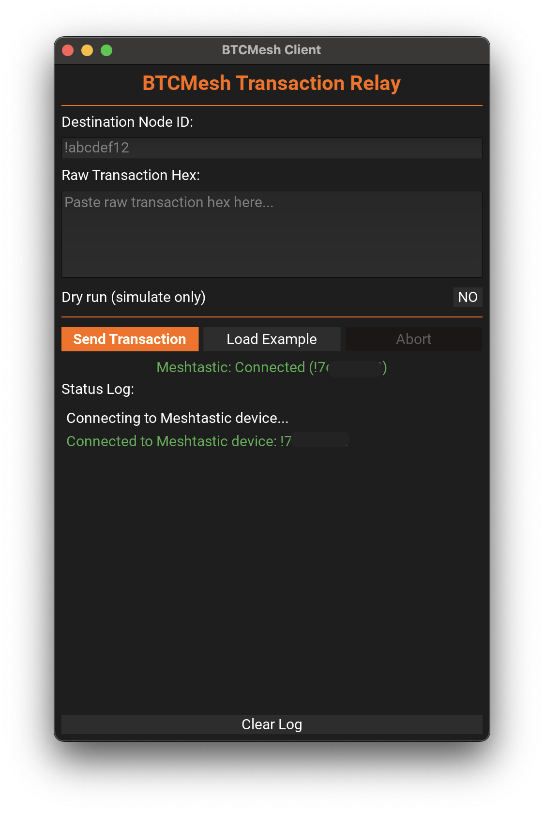
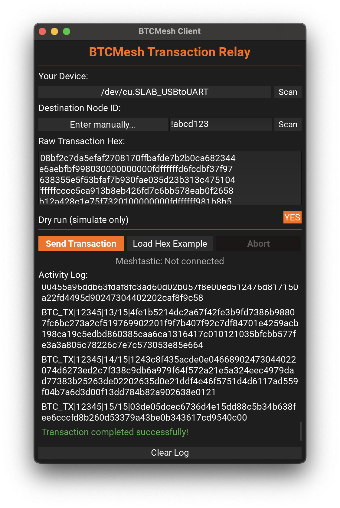

# BTC Mesh Relay

## Description

BTC Mesh Relay is a project designed to enable the broadcasting of Bitcoin raw transactions by sending them as chunked hexadecimal strings via LoRa Meshtastic direct messages. A dedicated client script (`btcmesh_cli.py`) will be used for sending, and a relay device running `btcmesh_server.py` will reassemble these chunks, decode, validate, and then relay the complete transaction to a configured Bitcoin RPC node. This system is intended for scenarios with limited or censored internet access but where LoRa Meshtastic network availability exists.

This project is currently under development.

## Features (Planned & In-Progress)

*   **Meshtastic Communication**: Initializes and manages communication with a Meshtastic device.
*   **Transaction Chunking & Reassembly**: Allows large Bitcoin transactions to be sent in smaller chunks over LoRa by `btcmesh_cli.py` and reassembled by `btcmesh_server.py`.
*   **Payload Handling**: Relay server reassembles hexadecimal chunks. The connected Bitcoin Core node performs full transaction validation upon broadcast attempt. (Advanced pre-broadcast decoding and validation capabilities on the relay server via `core/transaction_parser.py` are planned for future enhancements).
*   **Basic Transaction Validation**: Currently, the relay server relies on the connected Bitcoin Core node for most transaction validation. (More extensive pre-broadcast sanity checks on the relay are planned).
*   **Bitcoin RPC Integration**: Connects to a Bitcoin Core RPC node to broadcast the validated raw transaction.
*   **Logging**: Comprehensive logging for both server and client operations.
*   **Client Script (`btcmesh_cli.py`)**: Implemented command-line tool (`btcmesh_cli.py`) for users to send raw transactions.
*   **Tor Support**: Optionally connect to a Bitcoin RPC node via its `.onion` address (requires Tor to be installed and running on your system).

## Project Structure

```
btcmesh/
├── btcmesh_cli.py         # Command-line client script
├── btcmesh_gui.py         # Graphical user interface client
├── btcmesh_server.py      # Server/Relay script
├── core/                  # Core logic for the server/relay
│   ├── __init__.py
│   ├── config_loader.py   # For loading .env and other configurations
│   ├── logger_setup.py    # For setting up consistent logging
│   ├── transaction_parser.py # For decoding raw Bitcoin transactions (Planned)
│   ├── rpc_client.py      # For interacting with Bitcoin RPC
│   └── reassembler.py     # For reassembling chunked messages
├── project/               # Project planning documents
│   ├── tasks.txt
│   └── reference_materials.md
├── logs/                  # Directory for log files (created at runtime)
├── tests/                 # Unit and integration tests
├── .env.example           # Example environment variable configuration file
├── requirements.txt       # Python dependencies
└── README.md              # This file
```
(Refer to `project/tasks.txt` for detailed ongoing tasks and user stories.)

## Setup Instructions

1.  **Clone the Repository**:
    ```bash
    git clone https://github.com/eddieoz/btcmesh.git
    cd btcmesh
    ```

2.  **Create and Activate Conda Environment**:
    It's recommended to use a Conda environment. If you don't have Conda, please [install it first](https://docs.conda.io/projects/conda/en/latest/user-guide/install/index.html).
    ```bash
    conda create -n btcmesh python=3.11
    conda activate btcmesh
    ```
    Or use venv
    ```bash
    python -m venv env
    source env/bin/activate
    ```

3.  **Install Dependencies**:
    ```bash
    pip install -r requirements.txt
    ```

4.  **Configure Environment (.env)**:
    The application is configured using a `.env` file in the project root.
    Copy the example file to create your own configuration:
    ```bash
    cp .env.example .env
    ```
    Then, edit the `.env` file to set your specific configurations. For example:

    *   **`MESHTASTIC_SERIAL_PORT`**: Specifies the serial port for your Meshtastic device (e.g., `/dev/ttyUSB0`, `/dev/ttyACM0` on Linux, or `COM3` on Windows). If this is not set or is commented out, the application will attempt to auto-detect the Meshtastic device.
        ```env
        # MESHTASTIC_SERIAL_PORT=/dev/your/meshtastic_port
        ```
    *   **Bitcoin RPC Node Details**: Required for the relay server (`btcmesh_server.py`).
        ```env
        BITCOIN_RPC_HOST=your_bitcoin_node_host
        BITCOIN_RPC_PORT=your_bitcoin_node_port # e.g., 8332 for mainnet
        BITCOIN_RPC_USER=your_rpc_username
        BITCOIN_RPC_PASSWORD=your_rpc_password
        # Optional: For transaction reassembly timeout
        # REASSEMBLY_TIMEOUT_SECONDS=120
        ```
    *   **Connecting via Tor**: If you wish to connect to your Bitcoin RPC node via Tor, set the `BITCOIN_RPC_HOST` to your node's `.onion` address. **You must have Tor installed and running on your system** (see [Tor Setup](#tor-setup) below).
        ```env
        # Example for Tor connection:
        BITCOIN_RPC_HOST=yourbitcoinrpcnode.onion
        ```

5.  **Meshtastic Device Setup**:
    *   Ensure you have a Meshtastic device connected to the machine where `btcmesh_server.py` will run (and another for the client when `btcmesh_cli.py` is used).
    *   The Meshtastic Python library, by default, attempts to auto-detect your device. You can specify the serial port explicitly by setting `MESHTASTIC_SERIAL_PORT` in your `.env` file.
    *   Ensure your Bitcoin Core node is configured to accept RPC connections.
    *   Configure the RPC host, port, user, and password in your `.env` file (see step 4).
    *   **Tor Connectivity**: If `BITCOIN_RPC_HOST` is a `.onion` address, you must have Tor installed and running on your system. See [Tor Setup](#tor-setup) for installation instructions.

## Configuration

The primary method for configuration is via a `.env` file in the project root (see "Configure Environment (.env)" in Setup Instructions).

Key settings configurable in `.env`:

*   Meshtastic device serial port (`MESHTASTIC_SERIAL_PORT`).
*   Bitcoin RPC connection details (`BITCOIN_RPC_HOST`, `BITCOIN_RPC_PORT`, `BITCOIN_RPC_USER`, `BITCOIN_RPC_PASSWORD`). Use a `.onion` address for `BITCOIN_RPC_HOST` to route traffic through Tor (requires Tor to be installed and running).
*   Transaction reassembly timeout (`REASSEMBLY_TIMEOUT_SECONDS`).

## Running the Server (`btcmesh_server.py`)

Once set up and configured, you can run the BTC Mesh Relay server:

```bash
python btcmesh_server.py
```

The server will initialize the Meshtastic interface, connect to the Bitcoin RPC node (if configured), and start listening for incoming messages.

## Running the Client (`btcmesh_cli.py`)

The client script is used to send a raw Bitcoin transaction to a relay server.

```bash
python btcmesh_cli.py --destination <SERVER_NODE_ID> --tx <RAW_TRANSACTION_HEX>
```
Replace `<SERVER_NODE_ID>` with the Meshtastic node ID of the machine running `btcmesh_server.py` (e.g., `!abcdef12`) and `<RAW_TRANSACTION_HEX>` with the full raw transaction hex string you intend to broadcast.

Use `python btcmesh_cli.py --help` for more options, such as `--dry-run` to simulate sending without actually transmitting over LoRa.

## Running the GUI (`btcmesh_gui.py`)

The GUI provides a user-friendly graphical interface for sending Bitcoin transactions over the Meshtastic LoRa mesh network. It is just a wrapper around the CLI with visual feedback and easy-to-use controls.

### Starting the GUI

```bash
python btcmesh_gui.py
```

### GUI Features

- **Connection Status**: Displays Meshtastic device connection status with color-coded indicators (green = connected, red = failed)
- **Transaction Input**: Text fields for destination node ID and raw transaction hex
- **Dry Run Toggle**: Test your transaction without actually broadcasting
- **Real-time Status Log**: Color-coded scrollable log showing transaction progress
- **Success Popup**: Confirmation popup with TXID when transaction is successfully broadcast
- **Abort Button**: Cancel a transaction in progress
- **Load Example**: Quick-fill example data for testing

### GUI Layout



*Main window showing connection status, input fields, and status log*



*Main window in action trying to send a transaction in chunks to NodeID*

### Usage Instructions

1. **Connect your Meshtastic device** - The GUI will automatically attempt to connect on startup. The connection status indicator shows the result.

2. **Enter destination** - Type the relay server's Meshtastic node ID (e.g., `!abcdef12`) in the Destination field.

3. **Enter transaction hex** - Paste your raw Bitcoin transaction hex string in the Transaction Hex field.

4. **Toggle Dry Run** (optional) - Enable dry run mode to test without actually transmitting over LoRa.

5. **Click Send** - The transaction will be chunked and sent to the relay. Progress appears in the status log.

6. **Monitor progress** - Watch the status log for:
   - Green messages: Success/ACK confirmations
   - Orange messages: Warnings
   - Red messages: Errors

7. **Receive confirmation** - On successful broadcast, a popup displays the transaction ID (TXID).

## Tor Setup

To connect to a Bitcoin RPC node via its `.onion` address, you must have Tor installed and running on your system. The application will automatically route traffic through Tor's SOCKS proxy (default: `127.0.0.1:9050`).

### Installing Tor

**macOS** (using Homebrew):
```bash
brew install tor
brew services start tor
```

**Ubuntu/Debian**:
```bash
sudo apt update
sudo apt install tor
sudo systemctl start tor
sudo systemctl enable tor  # Optional: start on boot
```

**Windows**:
1. Download the Tor Expert Bundle from [torproject.org/download/tor/](https://www.torproject.org/download/tor/)
2. Extract and run `tor.exe`
3. Or install via Chocolatey: `choco install tor`

### Verifying Tor is Running

Check that Tor is listening on the SOCKS port:
```bash
# macOS/Linux
nc -zv 127.0.0.1 9050

# Or check the service status
# macOS
brew services list | grep tor

# Linux
sudo systemctl status tor
```

### Configuration

Once Tor is running, simply set your `.onion` address in the `.env` file:
```env
BITCOIN_RPC_HOST=yourbitcoinnode.onion
BITCOIN_RPC_PORT=8332
BITCOIN_RPC_USER=your_rpc_user
BITCOIN_RPC_PASSWORD=your_rpc_password
```

The application automatically detects `.onion` addresses and routes the connection through Tor.

### Troubleshooting

- **Connection refused**: Ensure Tor service is running (`brew services start tor` or `sudo systemctl start tor`)
- **Timeout errors**: Check that your `.onion` address is correct and the remote node is accessible
- **SOCKS proxy errors**: Verify Tor is using the default port 9050, or check your Tor configuration

## Running Tests

To run the automated tests:

```bash
python -m unittest discover -s tests -p 'test_*.py'
```

## Contributing

Contributions are welcome! Please refer to the project's issue tracker and development plan in `project/tasks.txt`. Follow TDD/BDD principles when adding new features or fixing bugs. 

## License

This project is licensed under the MIT License.

## Buy me a coffee
Did you like it? [Buy me a coffee](https://www.buymeacoffee.com/eddieoz)

[](https://www.buymeacoffee.com/eddieoz)

Or drop me a tip through Lightning Network: ⚡ [getalby.com/p/eddieoz](https://getalby.com/p/eddieoz)
