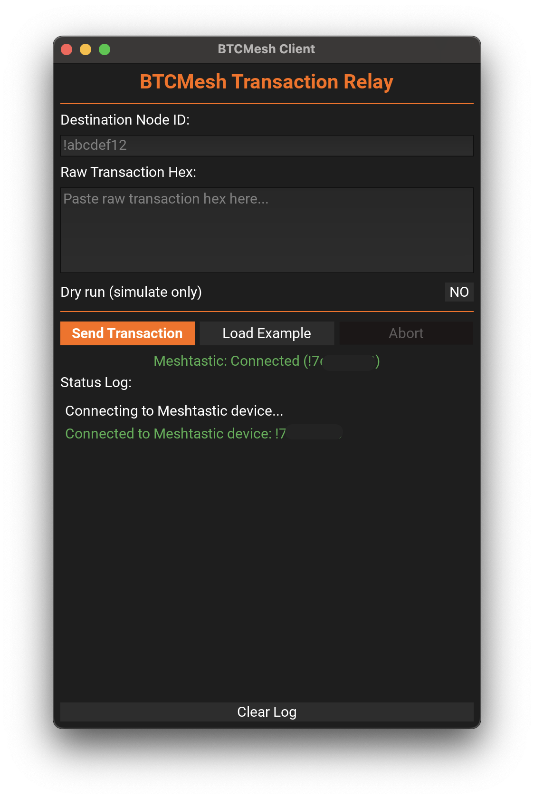
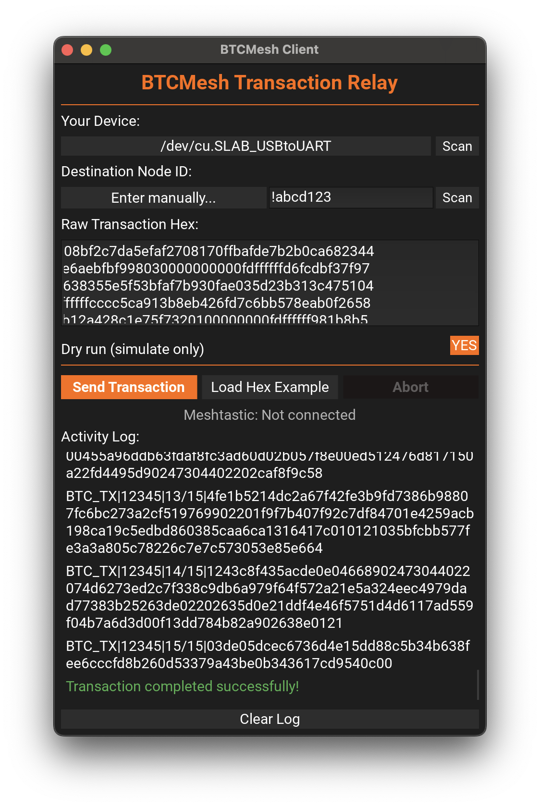
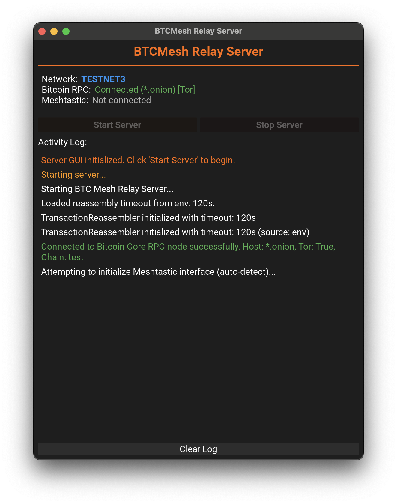

# BTC Mesh Relay

## Description

BTC Mesh Relay is a project designed to enable the broadcasting of Bitcoin raw transactions by sending them as chunked hexadecimal strings via LoRa mesh direct messages. A dedicated client script (`btcmesh_client_cli.py`) will be used for sending, and a relay device running `btcmesh_server_cli.py` will reassemble these chunks, decode, validate, and then relay the complete transaction to a configured Bitcoin RPC node. This system is intended for scenarios with limited or censored internet access but where LoRa mesh network availability exists.

Two mesh transports are supported: **Meshtastic** and **MeshCore**, selectable via `--transport` on both CLIs or a transport dropdown in both GUIs. Both speak the same chunked BTCMesh protocol underneath - see [Protocol Specification](project/protocol_spec.md).

This project is currently under development.

## Features (Planned & In-Progress)

*   **Meshtastic Communication**: Initializes and manages communication with a Meshtastic device.
*   **MeshCore Communication**: Alternative mesh transport (`--transport meshcore` on both CLIs, or a transport dropdown in both GUIs). A few rough edges remain: switching away from a transport can leave the next device scan slow, and an unknown destination on MeshCore currently surfaces a raw internal error instead of a clean message.
*   **Transaction Chunking & Reassembly**: Allows large Bitcoin transactions to be sent in smaller chunks over LoRa by `btcmesh_client_cli.py` and reassembled by `btcmesh_server_cli.py`.
*   **Payload Handling**: Relay server reassembles hexadecimal chunks. The connected Bitcoin Core node performs full transaction validation upon broadcast attempt. (Advanced pre-broadcast decoding and validation capabilities on the relay server via `core/transaction_parser.py` are planned for future enhancements).
*   **Basic Transaction Validation**: Currently, the relay server relies on the connected Bitcoin Core node for most transaction validation. (More extensive pre-broadcast sanity checks on the relay are planned).
*   **Bitcoin RPC Integration**: Connects to a Bitcoin Core RPC node to broadcast the validated raw transaction.
*   **Transaction History**: Completed transactions (success and failure) are persisted to `data/transaction_history.json` and viewable in the server GUI.
*   **Automatic Device Recovery**: An optional watchdog detects an unresponsive Meshtastic USB device and power-cycles it automatically (via a uhubctl-compatible hub, or a cheap DIY relay board - see [Device Recovery](#device-recovery-optional) below), instead of requiring a manual unplug/replug.
*   **Logging**: Comprehensive logging for both server and client operations.
*   **Client Script (`btcmesh_client_cli.py`)**: Implemented command-line tool (`btcmesh_client_cli.py`) for users to send raw transactions.
*   **Tor Support**: Optionally connect to a Bitcoin RPC node via its `.onion` address (requires Tor to be installed and running on your system).

## Project Structure

```
btcmesh/
├── btcmesh_client_cli.py  # Command-line client script
├── btcmesh_client_gui.py  # Graphical user interface client
├── btcmesh_server_cli.py  # Server/Relay script
├── btcmesh_server_gui.py  # Server GUI for relay operators
├── core/                  # Pure business logic (protocol, RPC, config, device utils)
│   ├── protocol.py         # Message chunking, parsing, session management
│   ├── message_types.py    # Wire message dataclasses
│   ├── reassembler.py      # Reassembling chunked messages
│   ├── transaction_parser.py # Decoding raw Bitcoin transactions
│   ├── transaction_history.py # Persistent transaction history storage
│   ├── device_watchdog.py  # Wedged-device detection + power-cycle recovery
│   ├── device_scan.py      # Transport-agnostic serial-port enumeration
│   ├── rpc_client.py       # Bitcoin RPC client
│   ├── config_loader.py    # Loading .env and other configuration
│   ├── meshtastic_utils.py # Meshtastic-specific identity probing
│   └── meshcore_utils.py   # MeshCore-specific identity probing
├── transport/             # Mesh device communication (Meshtastic + MeshCore serial, power control)
├── client/                # Client-side sending logic (chunking, ARQ, retries)
├── server/                # Server-side receiving logic (reassembly, broadcast)
├── gui/                   # Shared GUI components and styling (used by both GUIs)
├── hardware/              # DIY relay-board firmware for automatic device recovery
├── scripts/hw_tests/      # Real-hardware verification scripts
├── project/               # Project planning documents
│   ├── tasks.txt
│   ├── architecture.md
│   ├── protocol_spec.md
│   └── reference_materials.md
├── data/                  # Runtime data, e.g. transaction_history.json (created at runtime)
├── logs/                  # Directory for log files (created at runtime)
├── tests/                 # Unit and integration tests
├── .env.example           # Example environment variable configuration file
├── requirements.txt       # Python dependencies
└── README.md              # This file
```
(Refer to `project/tasks.txt` for detailed ongoing tasks and user stories, and `project/architecture.md` for the full architecture design.)

## Setup Instructions

1.  **Clone the Repository**:
    ```bash
    git clone https://github.com/eddieoz/btcmesh.git
    cd btcmesh
    ```

2.  **Create and Activate Conda Environment**:
    It's recommended to use a Conda environment. If you don't have Conda, please [install it first](https://docs.conda.io/projects/conda/en/latest/user-guide/install/index.html).
    ```bash
    conda create -n btcmesh python=3.11
    conda activate btcmesh
    ```
    Or use venv
    ```bash
    python -m venv env
    source env/bin/activate
    ```

    **Recommended:** install [direnv](https://direnv.net/) and add a `.envrc` file in the
    project root with `source env/bin/activate`, then run `direnv allow` once. This
    auto-activates the virtualenv whenever you `cd` into the project, so you never
    have to remember to activate it manually in a new terminal.
    ```bash
    brew install direnv        # macOS; see direnv.net for other platforms
    echo 'eval "$(direnv hook zsh)"' >> ~/.zshrc   # or ~/.bashrc for bash
    echo 'source env/bin/activate' > .envrc
    direnv allow .
    ```

3.  **Install Dependencies**:
    ```bash
    pip install -r requirements.txt
    ```

4.  **Configure Environment (.env)**:
    The application is configured using a `.env` file in the project root.
    Copy the example file to create your own configuration:
    ```bash
    cp .env.example .env
    ```
    Then, edit the `.env` file to set your specific configurations. For example:

    *   **`MESHTASTIC_SERIAL_PORT`**: Specifies the serial port for your Meshtastic device (e.g., `/dev/ttyUSB0`, `/dev/ttyACM0` on Linux, or `COM3` on Windows). If this is not set or is commented out, the application will attempt to auto-detect the Meshtastic device.
        ```env
        # MESHTASTIC_SERIAL_PORT=/dev/your/meshtastic_port
        ```
    *   **Bitcoin RPC Node Details**: Required for the relay server (`btcmesh_server_cli.py`).
        ```env
        BITCOIN_RPC_HOST=your_bitcoin_node_host
        BITCOIN_RPC_PORT=your_bitcoin_node_port # e.g., 8332 for mainnet
        BITCOIN_RPC_USER=your_rpc_username
        BITCOIN_RPC_PASSWORD=your_rpc_password
        # Optional: For transaction reassembly timeout
        # REASSEMBLY_TIMEOUT_SECONDS=120
        ```
    *   **Connecting via Tor**: If you wish to connect to your Bitcoin RPC node via Tor, set the `BITCOIN_RPC_HOST` to your node's `.onion` address. **You must have Tor installed and running on your system** (see [Tor Setup](#tor-setup) below).
        ```env
        # Example for Tor connection:
        BITCOIN_RPC_HOST=yourbitcoinrpcnode.onion
        ```

5.  **Meshtastic Device Setup**:
    *   Ensure you have a Meshtastic device connected to the machine where `btcmesh_server_cli.py` will run (and another for the client when `btcmesh_client_cli.py` is used).
    *   The Meshtastic Python library, by default, attempts to auto-detect your device. You can specify the serial port explicitly by setting `MESHTASTIC_SERIAL_PORT` in your `.env` file.
    *   Ensure your Bitcoin Core node is configured to accept RPC connections.
    *   Configure the RPC host, port, user, and password in your `.env` file (see step 4).
    *   **Tor Connectivity**: If `BITCOIN_RPC_HOST` is a `.onion` address, you must have Tor installed and running on your system. See [Tor Setup](#tor-setup) for installation instructions.

## Configuration

The primary method for configuration is via a `.env` file in the project root (see "Configure Environment (.env)" in Setup Instructions).

Key settings configurable in `.env`:

*   Meshtastic device serial port (`MESHTASTIC_SERIAL_PORT`).
*   Bitcoin RPC connection details (`BITCOIN_RPC_HOST`, `BITCOIN_RPC_PORT`, `BITCOIN_RPC_USER`, `BITCOIN_RPC_PASSWORD`). Use a `.onion` address for `BITCOIN_RPC_HOST` to route traffic through Tor (requires Tor to be installed and running).
*   Transaction reassembly timeout (`REASSEMBLY_TIMEOUT_SECONDS`).

## Device Recovery (Optional)

Meshtastic USB devices can occasionally become unresponsive ("wedged") after extended runtime. The relay server includes an optional watchdog (`core/device_watchdog.py`) that detects this - via repeated send failures or a periodic liveness check - and automatically power-cycles the device to recover, without needing anyone to physically unplug/replug it.

Automatic recovery requires a way to actually cut power to the device's USB connection:

*   **A uhubctl-compatible USB hub** - if your hub genuinely supports per-port (or whole-hub) power switching via [`uhubctl`](https://github.com/mvp/uhubctl), no extra hardware is needed.
*   **A DIY relay board** (recommended, since many hubs report success without actually cutting power) - a cheap ESP32 or ESP8266 microcontroller wired across the device's USB VBUS line, running the firmware in `hardware/power_relay_firmware/` (Arduino or PlatformIO project). See that firmware's source for wiring notes.

Configure which backend to use via `.env`:
```env
# DIY relay board (recommended)
RELAY_SERIAL_PORT=/dev/your/relay_board_port
# RELAY_SERIAL_BAUD=115200   # optional, matches the firmware default
# RELAY_CHANNEL=1            # optional, only needed if one board controls multiple devices
```

If no relay is configured, the server still detects and logs a wedged device - it just can't power-cycle it automatically.

## Running the Server (`btcmesh_server_cli.py`)

Once set up and configured, you can run the BTC Mesh Relay server:

```bash
python btcmesh_server_cli.py
```

The server will initialize the Meshtastic interface, connect to the Bitcoin RPC node (if configured), and start listening for incoming messages.

Use `-p`/`--port` to select a specific Meshtastic serial port when more than one device is connected, overriding `MESHTASTIC_SERIAL_PORT` in `.env`:

```bash
python btcmesh_server_cli.py -p /dev/ttyUSB0
```

Use `--transport meshcore` to run the relay over a MeshCore companion device instead of Meshtastic (default: `meshtastic`):

```bash
python btcmesh_server_cli.py --transport meshcore -p /dev/ttyUSB0
```

## Running the Client (`btcmesh_client_cli.py`)

The client script is used to send a raw Bitcoin transaction to a relay server.

```bash
python btcmesh_client_cli.py --destination <SERVER_NODE_ID> --tx <RAW_TRANSACTION_HEX>
```
Replace `<SERVER_NODE_ID>` with the Meshtastic node ID of the machine running `btcmesh_server_cli.py` (e.g., `!abcdef12`) and `<RAW_TRANSACTION_HEX>` with the full raw transaction hex string you intend to broadcast.

As with the server, add `--transport meshcore` to send over MeshCore instead - `<SERVER_NODE_ID>` then means the relay's MeshCore public-key-prefix hex instead of a `!nodeid`.

Use `python btcmesh_client_cli.py --help` for more options, such as `--dry-run` to simulate sending without actually transmitting over LoRa, or `-p`/`--port` to select a specific Meshtastic serial port when more than one device is connected.

## Running the Client GUI (`btcmesh_client_gui.py`)

The GUI provides a user-friendly graphical interface for sending Bitcoin transactions over the Meshtastic LoRa mesh network. It wraps the CLI with visual feedback and easy-to-use controls.

### Starting the Client GUI

```bash
python btcmesh_client_gui.py
```

### Client GUI Features

- **Mesh Transport Selection**: Dropdown to choose Meshtastic or MeshCore; switching rescans for devices under the newly selected transport
- **Device Selection**: Dropdown listing connected devices for the selected transport, each labeled with its node ID (and name, once known) as background identity probes complete
- **Busy Indicators**: The Scan and known-nodes-refresh buttons show their own progress text ("Scanning devices...", "Fetching known nodes...") while working, without blocking manual device/destination selection
- **Known Nodes Dropdown**: Select destination from previously seen mesh nodes, or type a node ID manually (Meshtastic only - MeshCore has no equivalent "known contacts" concept, so this picker is hidden when MeshCore is selected)
- **Transaction Input**: Text fields for destination node ID and raw transaction hex
- **Dry Run Toggle**: Test your transaction without actually broadcasting (YES/NO indicator)
- **Real-time Status Log**: Color-coded scrollable log showing transaction progress
- **Success Popup**: Styled confirmation popup with TXID and copy-to-clipboard button
- **Abort Button**: Cancel a transaction in progress
- **Load Hex Example**: Quick-fill example transaction data for testing
- **Disabled Controls During Send**: Input fields are locked while a transaction is actively sending

The app holds no ambient Meshtastic connection while idle - selecting a device only decides what Send will connect to; the actual connection happens when Send is pressed.

### Client GUI Layout

> **Note:** the screenshots below predate the node-ID device labels, busy indicators, and other features described above - a refresh is pending.



*Main window showing device selection, connection status, destination dropdown, and input fields*



*Main window in action sending a transaction in chunks to the relay server*

### Usage Instructions

1. **Select your Meshtastic device** - Use the device dropdown to select from available devices. Click "Scan" to refresh the list; each entry's label fills in with its node ID (and name) shortly after.

2. **Select or enter destination** - Choose a known node from the dropdown or manually type the relay server's Meshtastic node ID (e.g., `!abcdef12`).

3. **Enter transaction hex** - Paste your raw Bitcoin transaction hex string into the text field (standard OS paste, e.g. Cmd/Ctrl+V).

4. **Toggle Dry Run** (optional) - Enable dry run mode to test without actually transmitting over LoRa.

5. **Click Send** - The transaction will be chunked and sent to the relay. Progress appears in the status log.

6. **Monitor progress** - Watch the status log for:
   - Green messages: Success/ACK confirmations
   - Orange messages: Warnings
   - Red messages: Errors

7. **Receive confirmation** - On successful broadcast, a styled popup displays the transaction ID (TXID) with a copy button.

## Running the Server GUI (`btcmesh_server_gui.py`)

The Server GUI provides a graphical interface for relay operators to run and monitor the BTCMesh relay server.

### Starting the Server GUI

```bash
python btcmesh_server_gui.py
```

### Server GUI Features

- **Start/Stop Controls**: One-click buttons to start and stop the relay server
- **In-GUI Settings**: Bitcoin RPC credentials, mesh transport and device selection (Meshtastic or MeshCore, with Scan/node-ID labeling, same as the client), and the reassembly timeout are all editable directly in the window, with a Save Settings button that persists them to `.env`
- **Network Badge**: Displays the connected Bitcoin network (MAINNET/TESTNET3/TESTNET4/SIGNET) with color-coded badge
- **Bitcoin RPC Status**: Shows connection status to Bitcoin Core node with host information and Tor indicator
- **Mesh Transport Status**: Shows device connection status (Meshtastic or MeshCore, whichever is selected) with node ID and device path
- **Active Sessions**: Live panel showing in-progress transactions and their chunk-received progress
- **Activity Log**: Real-time color-coded log of all server events
- **Clear Log**: Button to clear the activity log
- **Transaction History**: Persistent, browsable log of past broadcast attempts (success and failure), stored in `data/transaction_history.json`
- **Automatic Device Recovery**: If configured (see [Device Recovery](#device-recovery-optional)), a wedged Meshtastic device is detected and power-cycled automatically, with recovery attempts reported in the Activity Log

### Server GUI Layout

> **Note:** the screenshot below predates Active Sessions, Transaction History, node-ID device labels, and automatic device recovery - a refresh is pending.



*Server GUI showing status indicators for Network, Bitcoin RPC, and Meshtastic connections*

The Server GUI displays:
- **Network**: Current Bitcoin network (orange for mainnet, blue for testnet, purple for signet)
- **Bitcoin RPC**: Connection status with host:port (or `*.onion [Tor]` for Tor connections)
- **Meshtastic**: Device connection status with node ID and device path

### Server Usage Instructions

1. **Configure Bitcoin RPC / Meshtastic settings** - Either edit `.env` directly, or fill in the Bitcoin RPC, Meshtastic device, and reassembly timeout fields in the GUI itself and click "Save Settings" to persist them to `.env`.

2. **Click Start Server** - The server will initialize connections to Meshtastic and Bitcoin RPC.

3. **Monitor status indicators**:
   - Network badge shows which Bitcoin network you're connected to
   - Green indicators show successful connections
   - Red indicators show connection failures

4. **Watch the activity log and Active Sessions panel** - Server events appear with color-coded messages in the log; in-progress transactions and their chunk progress appear in Active Sessions.

5. **Check Transaction History** - Click "History" to browse past broadcast attempts, success or failure.

6. **Click Stop Server** - Gracefully shuts down the relay server.

## Tor Setup

To connect to a Bitcoin RPC node via its `.onion` address, you must have Tor installed and running on your system. The application will automatically route traffic through Tor's SOCKS proxy (default: `127.0.0.1:9050`).

### Installing Tor

**macOS** (using Homebrew):
```bash
brew install tor
brew services start tor
```

**Ubuntu/Debian**:
```bash
sudo apt update
sudo apt install tor
sudo systemctl start tor
sudo systemctl enable tor  # Optional: start on boot
```

**Windows**:
1. Download the Tor Expert Bundle from [torproject.org/download/tor/](https://www.torproject.org/download/tor/)
2. Extract and run `tor.exe`
3. Or install via Chocolatey: `choco install tor`

### Verifying Tor is Running

Check that Tor is listening on the SOCKS port:
```bash
# macOS/Linux
nc -zv 127.0.0.1 9050

# Or check the service status
# macOS
brew services list | grep tor

# Linux
sudo systemctl status tor
```

### Configuration

Once Tor is running, simply set your `.onion` address in the `.env` file:
```env
BITCOIN_RPC_HOST=yourbitcoinnode.onion
BITCOIN_RPC_PORT=8332
BITCOIN_RPC_USER=your_rpc_user
BITCOIN_RPC_PASSWORD=your_rpc_password
```

The application automatically detects `.onion` addresses and routes the connection through Tor.

### Troubleshooting

- **Connection refused**: Ensure Tor service is running (`brew services start tor` or `sudo systemctl start tor`)
- **Timeout errors**: Check that your `.onion` address is correct and the remote node is accessible
- **SOCKS proxy errors**: Verify Tor is using the default port 9050, or check your Tor configuration

## Running Tests

To run the automated tests:

```bash
python -m unittest discover -s tests -p 'test_*.py'
```

## Contributing

Contributions are welcome! Please refer to the project's issue tracker and development plan in `project/tasks.txt`. Follow TDD/BDD principles when adding new features or fixing bugs. 

## License

This project is licensed under the MIT License.

## Buy me a coffee
Did you like it? [Buy me a coffee](https://www.buymeacoffee.com/eddieoz)

[](https://www.buymeacoffee.com/eddieoz)

Or drop me a tip through Lightning Network: ⚡ [getalby.com/p/eddieoz](https://getalby.com/p/eddieoz)
