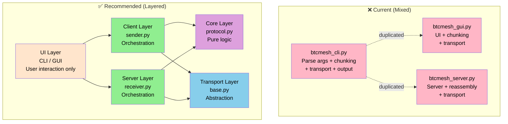
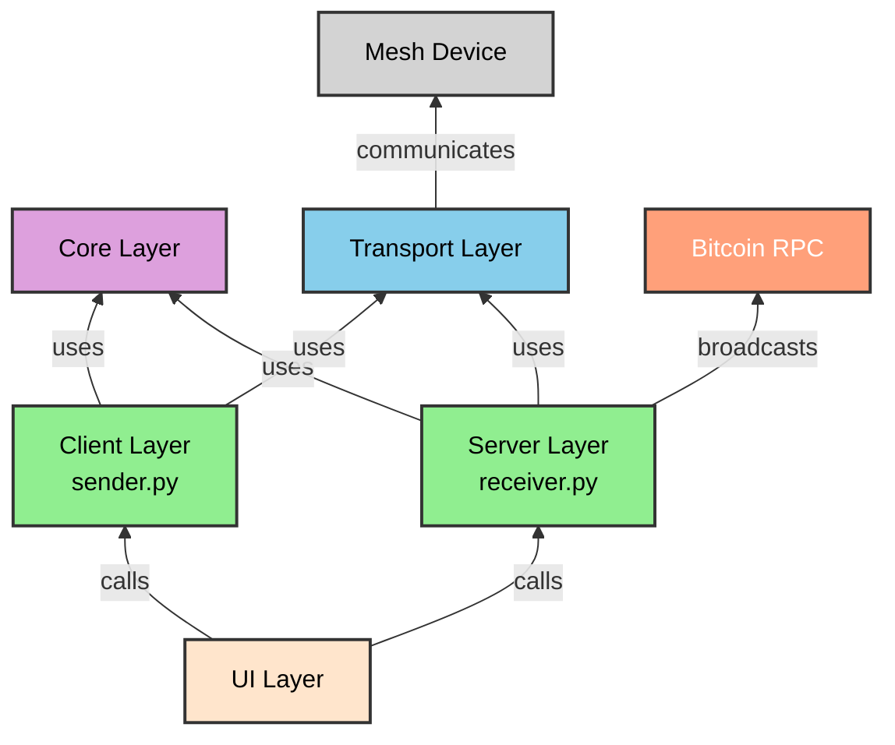
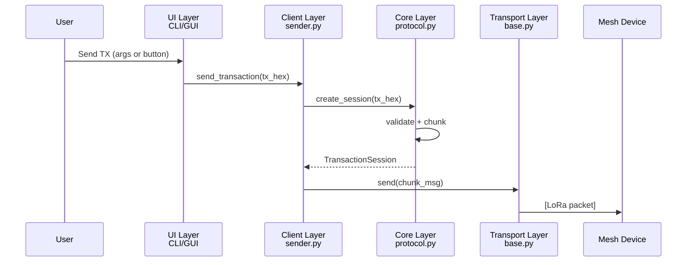
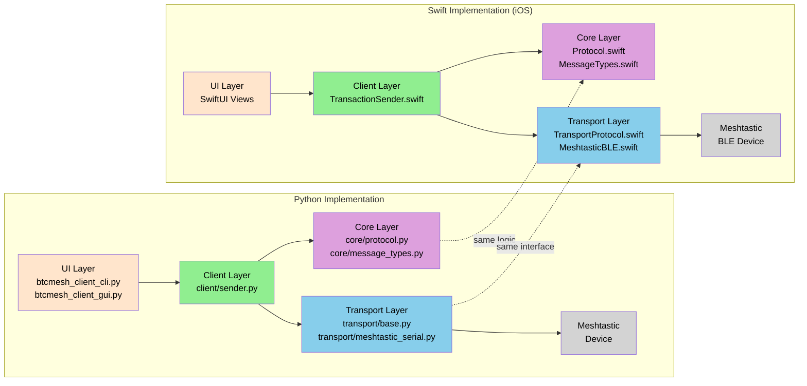

# BTCMesh Architecture Guide

**Date:** December 2025
**Status:** Recommended architecture for maintainability and cross-platform development

## Overview

This document defines the recommended architecture for BTCMesh to ensure:
- Clean separation of concerns
- Minimal code duplication
- Easy maintainability
- Consistent behavior across platforms (Python CLI, Desktop GUI, iOS)

---

## Current vs Recommended Architecture

### Current Structure (Issues)

```
btcmesh_cli.py          # Mixed: CLI parsing + client logic + protocol logic + transport + output
btcmesh_gui.py          # Wraps CLI, some duplicated logic
btcmesh_server.py       # Mixed: server logic + transport + reassembly
```

**Problems:**
- Business logic mixed with UI concerns
- Protocol logic duplicated or tightly coupled
- Hard to test in isolation
- Swift iOS must reimplement everything from scratch
- Protocol changes require updates in multiple places

### Current vs Recommended (Visual)



### Recommended Structure

```
btcmesh/
├── core/                       # Pure business logic (no I/O, no UI)
│   ├── protocol.py             # Message chunking, parsing, session management
│   ├── message_types.py        # Dataclasses for messages (BTC_TX, ACK, NACK)
│   ├── validation.py           # Transaction hex validation
│   └── constants.py            # Protocol constants (chunk size, timeouts)
│
├── transport/                  # Communication layer (abstracted)
│   ├── base.py                 # Abstract transport interface
│   ├── meshtastic_serial.py    # Serial/USB implementation
│   └── meshtastic_ble.py       # BLE implementation (desktop)
│
├── client/                     # Client-side implementations
│   ├── sender.py               # Transaction sending logic (uses core + transport)
│   └── session_manager.py      # Manages send sessions, retries, ACK handling
│
├── server/                     # Server-side implementations
│   ├── receiver.py             # Message receiving logic
│   ├── reassembler.py          # Transaction reassembly (already exists in core/)
│   └── broadcaster.py          # RPC broadcast logic
│
├── btcmesh_client_cli.py       # Thin CLI layer - argument parsing + output
├── btcmesh_client_gui.py       # Thin GUI layer - UI only
├── btcmesh_server_cli.py       # Thin server CLI entry point
└── btcmesh_server_gui.py       # Thin server GUI layer
```

### Layer Dependencies



### Data Flow Through Layers



> For the full protocol flow including ACKs and server-side handling, see [Protocol Specification](protocol_spec.md).

---

## Terminology: CLI vs Client vs Server

### Current Naming (Confusing)

The original codebase uses `btcmesh_cli.py` for the client entry point — mixing the terms **CLI** and **Client** as if they are the same thing. This causes confusion because the file contains both UI concerns (argument parsing) and business logic (chunking, retries, transport). Similarly `btcmesh_server.py` mixes server logic with transport and reassembly.

| File | What it's called | What it actually contains |
|------|-----------------|--------------------------|
| `btcmesh_cli.py` | "CLI" | CLI parsing + client logic + transport + protocol |
| `btcmesh_gui.py` | "GUI" | GUI widgets + client logic + transport |
| `btcmesh_server.py` | "Server" | Server logic + transport + reassembly + RPC |

### Recommended Naming (Clear)

In the target architecture, each file name reflects its actual responsibility:

| File | Layer | Responsibility |
|------|-------|---------------|
| `btcmesh_client_cli.py` | UI | Client entry point, Argument parsing, terminal output only |
| `btcmesh_client_gui.py` | UI | Client Widgets, user interaction only |
| `btcmesh_server_cli.py` | UI | Server entry point, terminal output only |
| `btcmesh_server_gui.py` | UI | Server widgets, user interaction only |
| `client/sender.py` | Client | Transaction sending, retries, state management |
| `server/receiver.py` | Server | Receiving, reassembly, broadcasting |

**Key distinction:**
- **CLI / GUI** = UI layer — how the user interacts with the app (terminal vs graphical)
- **Client** = business logic for sending — independent of UI
- **Server** = business logic for receiving and broadcasting — independent of UI
- Both CLI and GUI use the same Client/Server logic beneath them


## Layer Responsibilities

### 1. Core Layer (`core/`)

**Purpose:** Pure business logic with no dependencies on I/O, UI, or external systems.

**Rules:**
- NO print statements
- NO logging (return data, let caller log)
- NO network/file I/O
- NO UI framework imports
- Returns dataclasses/named tuples
- Raises exceptions for errors
- 100% unit testable

**Example: `core/protocol.py`**

```python
from dataclasses import dataclass
from typing import List
import secrets

# Constants
DEFAULT_CHUNK_SIZE = 170  # hex characters
SESSION_ID_LENGTH = 5

@dataclass
class TransactionSession:
    """Represents a chunked transaction ready for sending."""
    session_id: str
    chunks: List[str]

    @property
    def total_chunks(self) -> int:
        return len(self.chunks)

@dataclass
class ChunkMessage:
    """A single chunk message ready for transmission."""
    session_id: str
    chunk_number: int  # 1-indexed
    total_chunks: int
    payload: str

    def format(self) -> str:
        """Format as wire protocol string."""
        return f"BTC_TX|{self.session_id}|{self.chunk_number}/{self.total_chunks}|{self.payload}"

@dataclass
class AckMessage:
    """Parsed acknowledgment from server."""
    session_id: str
    chunk_number: int
    status: str  # 'OK', 'ERROR'
    next_chunk: int | None = None
    error_detail: str | None = None

@dataclass
class CompletionMessage:
    """Parsed completion message from server."""
    session_id: str
    success: bool
    txid: str | None = None
    error: str | None = None


def generate_session_id() -> str:
    """Generate a random 5-character hex session ID."""
    return secrets.token_hex(SESSION_ID_LENGTH // 2 + 1)[:SESSION_ID_LENGTH]


def create_session(tx_hex: str, chunk_size: int = DEFAULT_CHUNK_SIZE) -> TransactionSession:
    """
    Create a new transaction session with chunked data.

    Args:
        tx_hex: Raw transaction hex string
        chunk_size: Maximum characters per chunk

    Returns:
        TransactionSession with generated session_id and chunks

    Raises:
        ValueError: If tx_hex is empty or invalid
    """
    if not tx_hex:
        raise ValueError("Transaction hex cannot be empty")

    # Validate hex
    try:
        bytes.fromhex(tx_hex)
    except ValueError:
        raise ValueError("Invalid hex string")

    chunks = [tx_hex[i:i+chunk_size] for i in range(0, len(tx_hex), chunk_size)]

    return TransactionSession(
        session_id=generate_session_id(),
        chunks=chunks
    )


def get_chunk_message(session: TransactionSession, chunk_index: int) -> ChunkMessage:
    """
    Get a formatted chunk message for transmission.

    Args:
        session: The transaction session
        chunk_index: 0-based index of chunk to get

    Returns:
        ChunkMessage ready for transmission

    Raises:
        IndexError: If chunk_index out of range
    """
    if chunk_index < 0 or chunk_index >= session.total_chunks:
        raise IndexError(f"Chunk index {chunk_index} out of range (0-{session.total_chunks-1})")

    return ChunkMessage(
        session_id=session.session_id,
        chunk_number=chunk_index + 1,  # Wire protocol is 1-indexed
        total_chunks=session.total_chunks,
        payload=session.chunks[chunk_index]
    )


def parse_ack(message: str) -> AckMessage:
    """
    Parse an ACK message from server.

    Expected format: BTC_CHUNK_ACK|<session>|<chunk>|OK|REQUEST_CHUNK|<next>

    Args:
        message: Raw message string

    Returns:
        Parsed AckMessage

    Raises:
        ValueError: If message format is invalid
    """
    parts = message.split('|')

    if len(parts) < 4:
        raise ValueError(f"Invalid ACK format: {message}")

    if parts[0] != 'BTC_CHUNK_ACK':
        raise ValueError(f"Not an ACK message: {message}")

    session_id = parts[1]
    chunk_number = int(parts[2])
    status = parts[3]

    next_chunk = None
    if len(parts) >= 6 and parts[4] == 'REQUEST_CHUNK':
        next_chunk = int(parts[5])

    return AckMessage(
        session_id=session_id,
        chunk_number=chunk_number,
        status=status,
        next_chunk=next_chunk
    )


def parse_completion(message: str) -> CompletionMessage:
    """
    Parse a completion message (ACK or NACK) from server.

    Expected formats:
        BTC_ACK|<session>|SUCCESS|TXID:<txid>
        BTC_NACK|<session>|ERROR|<details>

    Args:
        message: Raw message string

    Returns:
        Parsed CompletionMessage

    Raises:
        ValueError: If message format is invalid
    """
    parts = message.split('|')

    if len(parts) < 3:
        raise ValueError(f"Invalid completion format: {message}")

    msg_type = parts[0]
    session_id = parts[1]

    if msg_type == 'BTC_ACK' and parts[2] == 'SUCCESS':
        txid = None
        if len(parts) >= 4 and parts[3].startswith('TXID:'):
            txid = parts[3][5:]  # Remove 'TXID:' prefix
        return CompletionMessage(session_id=session_id, success=True, txid=txid)

    elif msg_type == 'BTC_NACK':
        error = '|'.join(parts[3:]) if len(parts) > 3 else parts[2]
        return CompletionMessage(session_id=session_id, success=False, error=error)

    raise ValueError(f"Unknown completion message type: {message}")
```

### 2. Transport Layer (`transport/`)

**Purpose:** Abstract communication with mesh network devices. Protocol-agnostic — the same interface supports different mesh protocols (Meshtastic, MeshCore, Reticulum, etc.) and connection methods (serial, BLE, WiFi).

**Rules:**
- Implements a common interface
- Handles connection management
- Does NOT know about BTCMesh protocol (just sends/receives strings)
- Does NOT know about specific mesh protocols (node ID formats, packet structure)
- Can be mocked for testing

**Example: `transport/base.py`**

```python
from abc import ABC, abstractmethod
from typing import Callable, Optional

class TransportError(Exception):
    """Base exception for transport errors."""
    pass

class TransportConnectionError(TransportError):
    """Failed to connect to device."""
    pass

class TransportSendError(TransportError):
    """Failed to send message."""
    pass

MessageHandler = Callable[[str, str], None]  # (message_text, sender_id)

class BaseTransport(ABC):
    """Abstract base class for BTCMesh transport implementations."""

    @abstractmethod
    def connect(self, device_path: Optional[str] = None) -> None:
        """Connect to a device. Auto-detect if device_path is None."""
        ...

    @abstractmethod
    def disconnect(self) -> None:
        """Disconnect from device. No-op if not connected."""
        ...

    @abstractmethod
    def send(self, message: str, destination: str) -> None:
        """Send a text message to a destination node."""
        ...

    @abstractmethod
    def set_message_handler(self, handler: MessageHandler) -> None:
        """Register callback for incoming messages. Replaces previous handler."""
        ...

    @abstractmethod
    def remove_message_handler(self) -> None:
        """Remove the current message handler."""
        ...

    @property
    @abstractmethod
    def is_connected(self) -> bool:
        """Whether currently connected to a device."""
        ...

    @property
    @abstractmethod
    def local_node_id(self) -> Optional[str]:
        """Local node identifier, or None if not connected."""
        ...

    def __enter__(self) -> "BaseTransport":
        return self

    def __exit__(self, exc_type, exc_val, exc_tb) -> None:
        self.disconnect()
```

### 3. Client/Server Layer

**Purpose:** Orchestrates core logic and transport for specific use cases.

**Example: `client/sender.py`**

```python
from dataclasses import dataclass
from typing import Callable, Optional
from core.protocol import (
    create_session, get_chunk_message, parse_ack, parse_completion,
    TransactionSession, CompletionMessage
)
from transport.base import BaseTransport

@dataclass
class SendResult:
    """Result of sending a transaction."""
    success: bool
    txid: Optional[str] = None
    error: Optional[str] = None
    chunks_sent: int = 0
    total_chunks: int = 0


class TransactionSender:
    """
    Sends chunked transactions via Meshtastic.

    Uses stop-and-wait ARQ protocol with retries.
    """

    def __init__(
        self,
        transport: BaseTransport,
        ack_timeout: float = 30.0,
        max_retries: int = 3,
        on_progress: Optional[Callable[[int, int], None]] = None
    ):
        """
        Args:
            transport: Transport implementation to use
            ack_timeout: Seconds to wait for ACK
            max_retries: Max retries per chunk
            on_progress: Optional callback(chunks_sent, total_chunks)
        """
        self.transport = transport
        self.ack_timeout = ack_timeout
        self.max_retries = max_retries
        self.on_progress = on_progress

    def send(self, tx_hex: str, destination: str, dry_run: bool = False) -> SendResult:
        """
        Send a transaction to destination node.

        Args:
            tx_hex: Raw transaction hex
            destination: Destination node ID
            dry_run: If True, validate but don't send

        Returns:
            SendResult with success status and txid/error
        """
        # Create session (validates tx_hex)
        try:
            session = create_session(tx_hex)
        except ValueError as e:
            return SendResult(success=False, error=str(e))

        if dry_run:
            return SendResult(
                success=True,
                chunks_sent=session.total_chunks,
                total_chunks=session.total_chunks,
                error="Dry run - not sent"
            )

        # Send chunks with ACK handling
        # ... implementation details ...

        return SendResult(success=True, txid="...")
```

### 4. UI Layer (CLI, GUI)

**Purpose:** User interface only. As thin as possible.

**Rules:**
- Argument parsing / widget setup
- Display output / update UI
- Calls into client/server layer
- Does NOT contain business logic

**Example: Thin CLI**

```python
#!/usr/bin/env python3
"""BTCMesh CLI - Command-line interface for sending Bitcoin transactions."""

import argparse
import sys
from client.sender import TransactionSender, SendResult
from transport.meshtastic_serial import SerialTransport


def parse_args():
    parser = argparse.ArgumentParser(description='Send Bitcoin transaction via Meshtastic')
    parser.add_argument('-d', '--destination', required=True, help='Destination node ID')
    parser.add_argument('-tx', '--transaction', required=True, help='Raw transaction hex')
    parser.add_argument('--dry-run', action='store_true', help='Validate without sending')
    parser.add_argument('--device', help='Meshtastic device path')
    return parser.parse_args()


def print_progress(sent: int, total: int):
    print(f"Sent chunk {sent}/{total}")


def main():
    args = parse_args()

    # Setup transport
    transport = SerialTransport()

    try:
        transport.connect(args.device)
        print(f"Connected to {transport.local_node_id}")
    except Exception as e:
        print(f"Connection failed: {e}", file=sys.stderr)
        return 1

    # Create sender with progress callback
    sender = TransactionSender(
        transport=transport,
        on_progress=print_progress
    )

    # Send transaction
    result = sender.send(
        tx_hex=args.transaction,
        destination=args.destination,
        dry_run=args.dry_run
    )

    # Output result
    if result.success:
        if result.txid:
            print(f"SUCCESS! TXID: {result.txid}")
        else:
            print(f"Validated: {result.total_chunks} chunks")
        return 0
    else:
        print(f"FAILED: {result.error}", file=sys.stderr)
        return 1


if __name__ == '__main__':
    sys.exit(main())
```

---

## Protocol Specification

To ensure consistency between Python and Swift implementations, maintain a protocol specification.

> For the full protocol specification including state machines and sequence diagrams, see [Protocol Specification](protocol_spec.md).

### Message Formats

| Message | Format | Example |
|---------|--------|---------|
| Chunk | `BTC_TX\|{session}\|{n}/{total}\|{payload}` | `BTC_TX\|a1b2c\|1/5\|0200000001...` |
| Chunk ACK | `BTC_CHUNK_ACK\|{session}\|{n}\|OK\|REQUEST_CHUNK\|{next}` | `BTC_CHUNK_ACK\|a1b2c\|1\|OK\|REQUEST_CHUNK\|2` |
| Success | `BTC_ACK\|{session}\|SUCCESS\|TXID:{txid}` | `BTC_ACK\|a1b2c\|SUCCESS\|TXID:abc123...` |
| Error | `BTC_NACK\|{session}\|ERROR\|{details}` | `BTC_NACK\|a1b2c\|ERROR\|Invalid transaction` |

### Constants

| Constant | Value | Description |
|----------|-------|-------------|
| CHUNK_SIZE | 170 | Hex characters per chunk |
| SESSION_ID_LENGTH | 5 | Hex characters in session ID |
| ACK_TIMEOUT | 30 | Seconds to wait for ACK |
| MAX_RETRIES | 3 | Retry attempts per chunk |
| REASSEMBLY_TIMEOUT | 300 | Server-side session timeout (seconds) |

### Session ID Generation

- 5 character hexadecimal string
- Cryptographically random
- Python: `secrets.token_hex(3)[:5]`
- Swift: `UUID().uuidString.prefix(5).lowercased()`

---

## Swift iOS Implementation

The Swift implementation should mirror the Python core structure:

```
ios/BTCMesh/
├── Core/
│   ├── Protocol.swift          # Mirrors core/protocol.py
│   ├── MessageTypes.swift      # Mirrors core/message_types.py
│   └── Constants.swift         # Mirrors core/constants.py
│
├── Transport/
│   ├── TransportProtocol.swift # Mirrors transport/base.py
│   └── MeshtasticBLE.swift     # BLE implementation
│
├── Client/
│   └── TransactionSender.swift # Mirrors client/sender.py
│
└── UI/
    └── Views/...               # SwiftUI views
```

### Architecture Comparison: Python vs Swift



**Key principle:** The `Core/` layer should be **functionally equivalent** between Python and Swift. When the protocol changes:

1. Update `project/architecture.md` (this document) - Protocol Specification section
2. Update Python `core/protocol.py`
3. Update Swift `Core/Protocol.swift` with same logic
4. Run tests on both

This means a fix in the protocol logic benefits BOTH platforms simultaneously.

---

## Testing Strategy

### Unit Tests (Core Layer)

Test `core/` in complete isolation:

```python
# tests/test_protocol.py
import unittest
from core.protocol import create_session, get_chunk_message, parse_ack

class TestCreateSession(unittest.TestCase):
    def test_creates_correct_number_of_chunks(self):
        tx_hex = "a" * 500  # 500 hex chars
        session = create_session(tx_hex, chunk_size=170)
        self.assertEqual(session.total_chunks, 3)  # 170 + 170 + 160

    def test_empty_tx_raises_error(self):
        with self.assertRaises(ValueError):
            create_session("")

    def test_invalid_hex_raises_error(self):
        with self.assertRaises(ValueError):
            create_session("not-hex")
```

### Integration Tests (With Mocked Transport)

```python
# tests/test_sender_integration.py
from unittest.mock import Mock
from client.sender import TransactionSender

class TestTransactionSender(unittest.TestCase):
    def test_send_completes_successfully(self):
        mock_transport = Mock()
        mock_transport.is_connected = True

        sender = TransactionSender(transport=mock_transport)
        result = sender.send("aabbccdd", "!dest1234")

        self.assertTrue(result.success)
```

---

## Migration Path

### Phase 1: Extract Core Protocol
1. Create `core/protocol.py` with pure functions
2. Create `core/message_types.py` with dataclasses
3. Add unit tests for core
4. Keep existing CLI/GUI working

### Phase 2: Create Transport Abstraction
1. Create `transport/base.py` interface
2. Create `transport/meshtastic_serial.py` implementation
3. Update CLI and server to use new transport

### Phase 3: Refactor Client Layer
1. Create `client/sender.py`
2. Migrate sending logic from `btcmesh_cli.py`
3. Update GUI to use `client/sender.py`
4. Rename `btcmesh_cli.py` → `btcmesh_client_cli.py`

### Phase 4: Refactor Server Layer
1. Create `server/receiver.py`
2. Migrate receiving/reassembly logic from `btcmesh_server.py`
3. Update server GUI to use `server/receiver.py`
4. Rename `btcmesh_server.py` → `btcmesh_server_cli.py`

### Phase 5: Document Protocol & Cross-Platform
1. Finalize protocol specification
2. Create Swift `Core/` following specification
3. Ensure tests pass on both platforms

### Migration Path (Visual)


---

---

## Benefits Summary

| Aspect | Before | After |
|--------|--------|-------|
| Protocol change | Update CLI + GUI + iOS | Update `core/` + Swift `Core/` |
| Add new UI | Duplicate logic | Import `core/`, write thin UI |
| Unit testing | Complex mocking | Test `core/` in isolation |
| Code review | Mixed concerns | Clear layer boundaries |
| Bug in chunking | Debug CLI? GUI? Both? | Debug `core/protocol.py` |
| Swift implementation | Start from scratch | Follow spec + reference Python |

---

## References

- [Protocol Specification](protocol_spec.md) - Message formats, state machines, protocol flow
- [Mobile Platform Analysis](mobile_platform_analysis.md) - iOS/Android strategy
- [Protocol Reference Materials](reference_materials.md) - Example transactions
- [Meshtastic Python Library](https://github.com/meshtastic/python)
- [Meshtastic iOS App](https://github.com/meshtastic/Meshtastic-Apple) - Swift BLE reference
