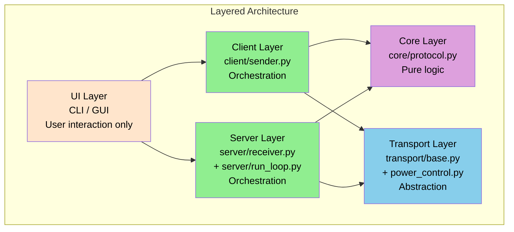
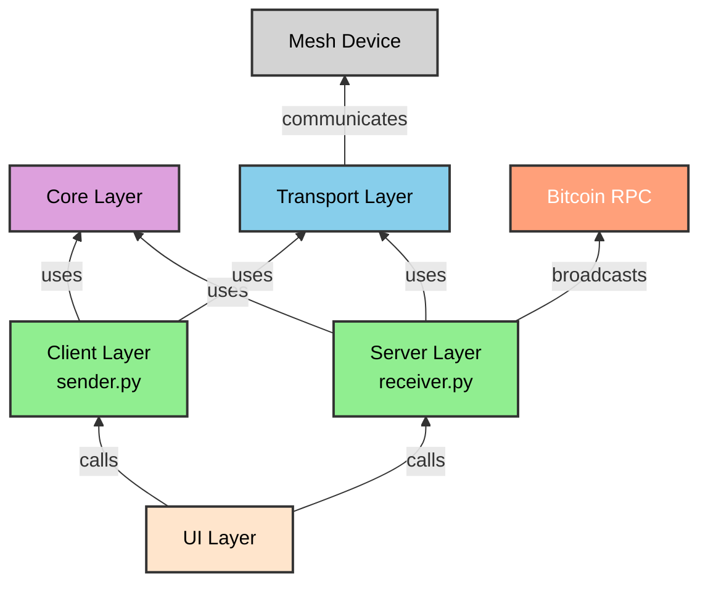
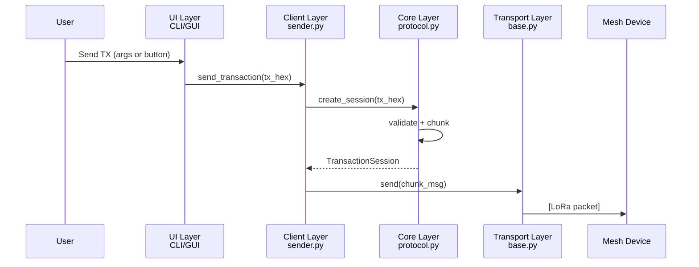
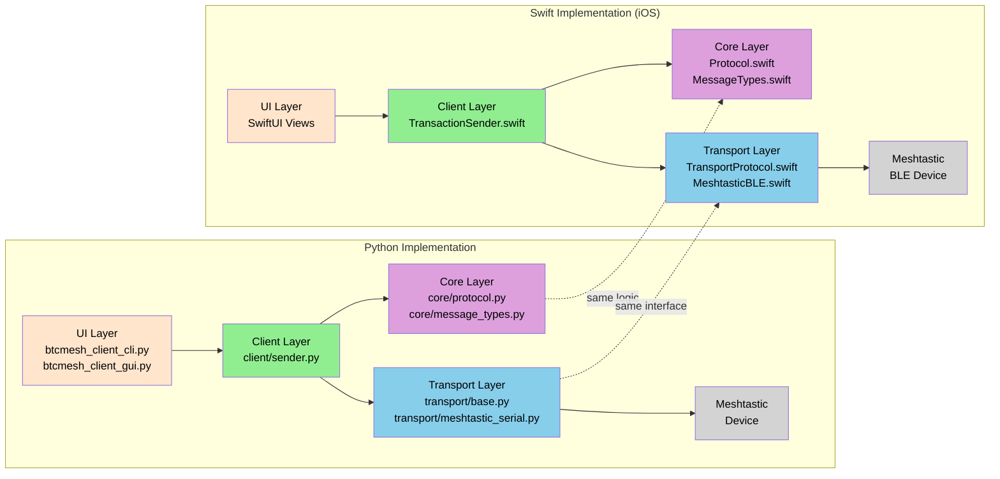

# BTCMesh Architecture Guide

**Date:** August 2026
**Status:** Implemented - describes the current codebase, not a future plan

## Overview

This document defines the layered architecture BTCMesh is built on, which
achieves:
- Clean separation of concerns
- Minimal code duplication
- Easy maintainability
- Consistent behavior across platforms (Python CLI, Desktop GUI, future iOS)

The layering below (EPIC 3 in `project/tasks.txt`, Stories 20-23) was
completed in full: `core/`, `transport/`, `client/`, and `server/` all
exist and are used by every UI entry point. The historical "mixed"
`btcmesh_cli.py`/`btcmesh_gui.py`/`btcmesh_server.py` files this refactor
replaced no longer exist in the codebase.

---

## Layered Architecture (Visual)


```mermaid
graph TB
    subgraph LAYERED["Layered Architecture"]
        UI2["UI Layer<br/>CLI / GUI<br/>User interaction only"]
        CLIENT2["Client Layer<br/>client/sender.py<br/>Orchestration"]
        SERVER2["Server Layer<br/>server/receiver.py<br/>+ server/run_loop.py<br/>Orchestration"]
        CORE2["Core Layer<br/>core/protocol.py<br/>Pure logic"]
        TRANSPORT2["Transport Layer<br/>transport/base.py<br/>+ power_control.py<br/>Abstraction"]

        UI2 --> CLIENT2
        UI2 --> SERVER2
        CLIENT2 --> CORE2
        SERVER2 --> CORE2
        CLIENT2 --> TRANSPORT2
        SERVER2 --> TRANSPORT2
    end

    style UI2 fill:#FFE5CC,color:#000
    style CLIENT2 fill:#90EE90,color:#000
    style SERVER2 fill:#90EE90,color:#000
    style CORE2 fill:#DDA0DD,color:#000
    style TRANSPORT2 fill:#87CEEB,color:#000
```

### Current Structure

```
btcmesh/
├── core/                       # Pure business logic (no I/O, no UI)
│   ├── protocol.py             # Message chunking, parsing, session management
│   ├── message_types.py        # Dataclasses for messages (BTC_TX, ACK, NACK)
│   ├── constants.py            # Protocol constants (per-transport chunk size, timeouts)
│   ├── reassembler.py          # Server-side transaction reassembly
│   ├── transaction_parser.py   # Raw Bitcoin transaction decoder (SegWit-aware)
│   ├── transaction_history.py  # Persistent JSON transaction history (server-side; client-side is still open, see project/tasks.txt Story 6.6)
│   ├── device_watchdog.py      # DeviceWatchdog - wedge detection + power-cycle recovery (EPIC 5)
│   ├── device_scan.py          # Transport-agnostic serial-port enumeration (shared by every transport)
│   ├── rpc_client.py           # Bitcoin Core RPC client (incl. Tor/.onion support)
│   ├── config_loader.py        # .env configuration loading
│   ├── logger_setup.py         # Rotating file + console logging setup
│   ├── meshtastic_utils.py     # Meshtastic-specific identity probing, node formatting
│   └── meshcore_utils.py       # MeshCore-specific identity probing (EPIC 9)
│
├── transport/                  # Communication layer (protocol-agnostic)
│   ├── base.py                 # Abstract transport interface (BaseTransport)
│   ├── factory.py              # get_transport(name) - selects Meshtastic vs MeshCore (EPIC 9)
│   ├── meshtastic_serial.py    # Meshtastic serial/USB implementation
│   ├── meshcore_serial.py      # MeshCore serial/USB implementation (EPIC 9) - wraps an asyncio-native client library
│   └── power_control.py        # BasePowerControl + Uhubctl/SerialRelay backends (EPIC 5)
│
├── client/                     # Client-side implementation
│   └── sender.py                # TransactionSender - chunking, ARQ, retries (uses core + transport)
│
├── server/                     # Server-side implementation
│   ├── receiver.py             # TransactionReceiver - reassembly, validation, broadcast
│   └── run_loop.py             # Shared receiver wiring + polling loop (used by both server CLI and GUI)
│
├── gui/                        # Shared GUI building blocks (Kivy)
│   └── gui_common.py            # Styling, StatusLog, BusyIndicator, device-probe dropdown helpers
│
├── hardware/                   # DIY relay-board firmware (EPIC 5 / Story 26.7)
│   └── power_relay_firmware/    # Arduino/PlatformIO sketch for SerialRelayPowerControl
│
├── scripts/hw_tests/           # Ad-hoc real-hardware verification scripts (see its README)
│
├── btcmesh_client_cli.py       # Thin CLI layer - argument parsing + output
├── btcmesh_client_gui.py       # Thin GUI layer - UI only
├── btcmesh_server_cli.py       # Thin server CLI entry point
└── btcmesh_server_gui.py       # Thin server GUI layer
```

`core/validation.py` and `client/session_manager.py`, shown in earlier
drafts of this document, were never needed as separate modules - hex
validation lives in `core/protocol.py`'s `create_session()`, and session/
retry state lives directly in `client/sender.py`. `transport/
meshtastic_ble.py` (BLE) also remains unbuilt - no BLE transport exists
yet; see `project/mobile_platform_analysis.md` for why mobile went native
Swift/Kotlin instead of a shared Python BLE layer.

Device scanning is split by how transport-specific it is:
`core/device_scan.py` enumerates candidate serial ports (VID-blacklist
filtering, OS-path dedup) with zero protocol content, shared by every
transport; `core/meshtastic_utils.py` and `core/meshcore_utils.py` each
provide their own `probe_device_identity()` - actually connecting to
learn a candidate's real node ID/name, which is inherently
transport-specific (EPIC 9).

### Layer Dependencies


```mermaid
graph BT
    UI["UI Layer"]
    CLIENT["Client Layer<br/>sender.py"]
    SERVER["Server Layer<br/>receiver.py"]
    CORE["Core Layer"]
    TRANSPORT["Transport Layer"]
    DEVICE["Mesh Device"]
    RPC["Bitcoin RPC"]

    UI -->|calls| CLIENT
    UI -->|calls| SERVER
    CLIENT -->|uses| CORE
    SERVER -->|uses| CORE
    CLIENT -->|uses| TRANSPORT
    SERVER -->|uses| TRANSPORT
    TRANSPORT -->|communicates| DEVICE
    SERVER -->|broadcasts| RPC

    style UI fill:#FFE5CC,color:#000,stroke:#333,stroke-width:2px
    style CLIENT fill:#90EE90,color:#000,stroke:#333,stroke-width:2px
    style SERVER fill:#90EE90,color:#000,stroke:#333,stroke-width:2px
    style CORE fill:#DDA0DD,color:#000,stroke:#333,stroke-width:2px
    style TRANSPORT fill:#87CEEB,color:#000,stroke:#333,stroke-width:2px
    style DEVICE fill:#D3D3D3,color:#000,stroke:#333,stroke-width:2px
    style RPC fill:#FFA07A,color:#FFF,stroke:#333,stroke-width:2px
```

### Data Flow Through Layers


```mermaid
sequenceDiagram
    participant User
    participant UI as UI Layer<br/>CLI/GUI
    participant Client as Client Layer<br/>sender.py
    participant Core as Core Layer<br/>protocol.py
    participant Transport as Transport Layer<br/>base.py
    participant Device as Mesh Device

    User->>UI: Send TX (args or button)
    UI->>Client: send_transaction(tx_hex)
    Client->>Core: create_session(tx_hex)
    Core->>Core: validate + chunk
    Core-->>Client: TransactionSession
    Client->>Transport: send(chunk_msg)
    Transport->>Device: [LoRa packet]
```

> For the full protocol flow including ACKs and server-side handling, see [Protocol Specification](protocol_spec.md).

---

## Terminology: CLI vs Client vs Server

The original codebase used `btcmesh_cli.py` for the client entry point — mixing the terms **CLI** and **Client** as if they are the same thing, and containing both UI concerns (argument parsing) and business logic (chunking, retries, transport) in one file. Similarly `btcmesh_server.py` mixed server logic with transport and reassembly. Both files were deleted once their replacements below were verified (Stories 22.3/22.4/23.3).

### Current Naming (Clear)

Each file name reflects its actual responsibility:

| File | Layer | Responsibility |
|------|-------|---------------|
| `btcmesh_client_cli.py` | UI | Client entry point, Argument parsing, terminal output only |
| `btcmesh_client_gui.py` | UI | Client Widgets, user interaction only |
| `btcmesh_server_cli.py` | UI | Server entry point, terminal output only |
| `btcmesh_server_gui.py` | UI | Server widgets, user interaction only |
| `client/sender.py` | Client | Transaction sending, retries, state management |
| `server/receiver.py` | Server | Receiving, reassembly, broadcasting |

**Key distinction:**
- **CLI / GUI** = UI layer — how the user interacts with the app (terminal vs graphical)
- **Client** = business logic for sending — independent of UI
- **Server** = business logic for receiving and broadcasting — independent of UI
- Both CLI and GUI use the same Client/Server logic beneath them


## Layer Responsibilities

### 1. Core Layer (`core/`)

**Purpose:** Pure business logic with no dependencies on I/O, UI, or external systems.

**Rules:**
- NO print statements
- NO logging (return data, let caller log)
- NO network/file I/O
- NO UI framework imports
- Returns dataclasses/named tuples
- Raises exceptions for errors
- 100% unit testable

**Actual message types (`core/message_types.py`) and parsing/chunking
functions (`core/protocol.py`):**

The five wire/session dataclasses - `ChunkMessage`, `ChunkAckMessage`,
`AckMessage`, `NackMessage` (each with a `format()` method producing the
exact wire string), and the internal `TransactionSession` - plus
`core/protocol.py`'s `create_session()`, `get_chunk_message()`,
`parse_chunk()`, `parse_chunk_ack()`, `parse_ack()`, `parse_nack()`, and
`parse_message()` (a dispatching parser returning whichever typed message
matches). See [Protocol Specification](protocol_spec.md) for the full
class diagram, wire formats, and state machines - reproducing it here
would just drift out of sync with that document again, as the previous
version of this section did.

### 2. Transport Layer (`transport/`)

**Purpose:** Abstract communication with mesh network devices. Protocol-agnostic — the same interface supports different mesh protocols (Meshtastic, MeshCore, Reticulum, etc.) and connection methods (serial, BLE, WiFi).

**Rules:**
- Implements a common interface
- Handles connection management
- Does NOT know about BTCMesh protocol (just sends/receives strings)
- Does NOT know about specific mesh protocols (node ID formats, packet structure)
- Can be mocked for testing

**Example: `transport/base.py`**

```python
from abc import ABC, abstractmethod
from typing import Callable, Optional

class TransportError(Exception):
    """Base exception for transport errors."""
    pass

class TransportConnectionError(TransportError):
    """Failed to connect to device."""
    pass

class TransportSendError(TransportError):
    """Failed to send message."""
    pass

MessageHandler = Callable[[str, str], None]  # (message_text, sender_id)

class BaseTransport(ABC):
    """Abstract base class for BTCMesh transport implementations."""

    @abstractmethod
    def connect(self, device_path: Optional[str] = None) -> None:
        """Connect to a device. Auto-detect if device_path is None."""
        ...

    @abstractmethod
    def disconnect(self) -> None:
        """Disconnect from device. No-op if not connected."""
        ...

    @abstractmethod
    def send(self, message: str, destination: str) -> None:
        """Send a text message to a destination node."""
        ...

    @abstractmethod
    def set_message_handler(self, handler: MessageHandler) -> None:
        """Register callback for incoming messages. Replaces previous handler."""
        ...

    @abstractmethod
    def remove_message_handler(self) -> None:
        """Remove the current message handler."""
        ...

    @abstractmethod
    def check_alive(self, timeout_seconds: Optional[float] = None) -> bool:
        """Best-effort liveness check - False (never raises) if not
        connected or unresponsive within timeout_seconds."""
        ...

    @abstractmethod
    def scan_for_reconnect_candidates(self) -> list[str]:
        """Candidate targets to try reconnecting to after a recovery
        power-cycle (see DeviceWatchdog, below)."""
        ...

    @abstractmethod
    def validate_destination(self, destination: str) -> None:
        """Raise ValueError if destination isn't a structurally valid
        address for this transport's own addressing scheme (EPIC 9,
        Story 30.2) - e.g. Meshtastic's `!hex8` vs MeshCore's bare
        public-key-prefix hex. Moved here from a single free function in
        core/protocol.py once a second transport needed a different rule."""
        ...

    @property
    @abstractmethod
    def max_chunk_size(self) -> int:
        """Maximum hex-character chunk payload this transport can carry
        in one message (EPIC 9, Issue 51) - Meshtastic and MeshCore have
        different message-size limits, so this is no longer a single
        global constant in core/constants.py."""
        ...

    @property
    @abstractmethod
    def is_connected(self) -> bool:
        """Whether currently connected to a device."""
        ...

    @property
    @abstractmethod
    def local_node_id(self) -> Optional[str]:
        """Local node identifier, or None if not connected."""
        ...

    def __enter__(self) -> "BaseTransport":
        return self

    def __exit__(self, exc_type, exc_val, exc_tb) -> None:
        self.disconnect()
```

### 2a. Transport Selection and the MeshCore Backend

`transport/factory.py`'s `get_transport(name)` returns a `MeshtasticSerialTransport`
or `MeshCoreSerialTransport` instance for `name` in `TRANSPORT_CHOICES =
("meshtastic", "meshcore")` - both CLIs expose this as a `--transport`
flag, defaulting to `meshtastic` so existing usage is unaffected.

`transport/meshcore_serial.py`'s `MeshCoreSerialTransport` (EPIC 9) is the
second concrete `BaseTransport` implementation - the one this abstraction
was designed to make possible without touching `client/`, `server/`, or
`core/protocol.py`. It wraps the `meshcore` Python library's
asyncio-native client into `BaseTransport`'s synchronous API: a dedicated
background thread runs the client's asyncio event loop for the
connection's lifetime, and every call that needs to `await` something
bridges into that loop via a bounded `_run_coro()` helper (mirroring the
"never block the caller forever on a wedged device" guarantee
`MeshtasticSerialTransport.send()` already gives for Issue 21). MeshCore's
own per-message size limit is much smaller than Meshtastic's, hence
`max_chunk_size` moving from a single global constant to a per-transport
property (`core/constants.py`'s `DEFAULT_CHUNK_SIZE` vs
`MESHCORE_MAX_CHUNK_SIZE`).

MeshCore support is CLI-only so far - device scanning/identity and GUI
wiring (`project/tasks.txt` Story 30.4) is deferred, and the GUIs still
only drive `MeshtasticSerialTransport`.

### 2b. Device Recovery: `transport/power_control.py` + `core/device_watchdog.py`

A companion abstraction sits alongside `BaseTransport`: `BasePowerControl`
(`transport/power_control.py`) defines a single `power_cycle(off_seconds)`
method, backed by either `UhubctlPowerControl` (a uhubctl-compatible USB
hub) or `SerialRelayPowerControl` (a DIY ESP32/ESP8266 relay board talking
the `CYCLE`/`OK`/`ERR` protocol implemented by
`hardware/power_relay_firmware/src/power_relay.ino`).

`core/device_watchdog.py`'s `DeviceWatchdog` combines a `BaseTransport` and
an optional `BasePowerControl` to detect a wedged device (via repeated
send/connect failures, or a periodic `check_alive()` heartbeat) and drive
recovery: disconnect, power-cycle, poll for the device's real
`local_node_id` to reappear, reconnect. It has no background thread of its
own - callers (`server/run_loop.py`'s `run_polling_loop()`) drive it via
`tick()` plus `record_success()`/`record_failure()` around each transport
operation. See `project/tasks.txt` EPIC 5 for the full story history and
`project/issues.txt` (Issues 12, 16, 19, 20, 46, 48) for the real-hardware
findings that shaped this design.

### 3. Client/Server Layer

**Purpose:** Orchestrates core logic and transport for specific use cases.

**Example: `client/sender.py`**

```python
from dataclasses import dataclass
from typing import Callable, Optional
from transport.base import BaseTransport

class TransactionSender:
    """Orchestrates stop-and-wait ARQ sending of chunked transactions.
    One send in flight per instance - both CLI and GUI create a fresh
    instance per send."""

    def __init__(
        self,
        transport: BaseTransport,
        timeout_seconds: int = 30,
        max_retries: int = 3,
    ):
        ...

    def send_transaction(
        self,
        tx_hex: str,
        destination: str,
        on_progress: Optional[Callable[[int, int], None]] = None,
        on_chunk_sending: Optional[Callable[[int, int, int, str], None]] = None,
        on_response_received: Optional[Callable[[str], None]] = None,
    ) -> SendResult:
        """Validates hex, chunks it, sends each chunk with ACK wait and
        retries, then waits for the final BTC_ACK/BTC_NACK. Returns a
        SendResult(success, session_id, txid=..., error=...)."""
        ...

    def abort(self) -> None:
        """Request abort of the in-progress send; checked between chunks."""
        ...
```

(This is a trimmed signature reference, not the full implementation - see
`client/sender.py` for the real ARQ loop, retry/timeout bookkeeping, and
the internal `SendSession` state tracker.)

### 4. UI Layer (CLI, GUI)

**Purpose:** User interface only. As thin as possible.

**Rules:**
- Argument parsing / widget setup
- Display output / update UI
- Calls into client/server layer
- Does NOT contain business logic

**Example: Thin CLI**

```python
#!/usr/bin/env python3
"""BTCMesh CLI - Command-line interface for sending Bitcoin transactions."""

import argparse
import sys
from client.sender import TransactionSender
from transport.meshtastic_serial import MeshtasticSerialTransport


def parse_args():
    parser = argparse.ArgumentParser(description='Send Bitcoin transaction via Meshtastic')
    parser.add_argument('-d', '--destination', required=True, help='Destination node ID')
    parser.add_argument('-tx', '--transaction', required=True, help='Raw transaction hex')
    parser.add_argument('--device', help='Meshtastic device path')
    return parser.parse_args()


def print_progress(sent: int, total: int):
    print(f"Sent chunk {sent}/{total}")


def main():
    args = parse_args()

    # Setup transport
    transport = MeshtasticSerialTransport()

    try:
        transport.connect(args.device)
        print(f"Connected to {transport.local_node_id}")
    except Exception as e:
        print(f"Connection failed: {e}", file=sys.stderr)
        return 1

    # Create sender and send transaction
    sender = TransactionSender(transport=transport)
    result = sender.send_transaction(
        tx_hex=args.transaction,
        destination=args.destination,
        on_progress=print_progress,
    )

    # Output result
    if result.success:
        print(f"SUCCESS! TXID: {result.txid}")
        return 0
    else:
        print(f"FAILED: {result.error}", file=sys.stderr)
        return 1


if __name__ == '__main__':
    sys.exit(main())
```

---

## Protocol Specification

To ensure consistency between Python and Swift implementations, maintain a protocol specification.

> For the full protocol specification including state machines and sequence diagrams, see [Protocol Specification](protocol_spec.md).

### Message Formats

| Message | Format | Example |
|---------|--------|---------|
| Chunk | `BTC_TX\|{session}\|{n}/{total}\|{payload}` | `BTC_TX\|a1b2c\|1/5\|0200000001...` |
| Chunk ACK | `BTC_CHUNK_ACK\|{session}\|{n}\|REQUEST_CHUNK\|{next}` or `...\|ALL_CHUNKS_RECEIVED` | `BTC_CHUNK_ACK\|a1b2c\|1\|REQUEST_CHUNK\|2` |
| Success | `BTC_ACK\|{session}\|TXID:{txid}` | `BTC_ACK\|a1b2c\|TXID:abc123...` |
| Error | `BTC_NACK\|{session}\|{details}` | `BTC_NACK\|a1b2c\|Insufficient fee` |

(The status fields shown in earlier drafts of this table - `OK`, `SUCCESS`, `ERROR` - were removed as redundant bloat in Story 20.4; see Issue 7 in `project/issues.txt`.)

### Constants

| Constant | Value | Description |
|----------|-------|-------------|
| DEFAULT_CHUNK_SIZE | 170 | Hex characters per chunk, Meshtastic transport |
| MESHCORE_MAX_CHUNK_SIZE | 120 | Hex characters per chunk, MeshCore transport (its own message-size limit is smaller - EPIC 9, Issue 51) |
| SESSION_ID_LENGTH | 5 | Hex characters in session ID |
| ACK_TIMEOUT | 30 | Seconds to wait for ACK |
| MAX_RETRIES | 3 | Retry attempts per chunk |
| REASSEMBLY_TIMEOUT | 300 | Server-side session timeout (seconds) |

Chunk size stopped being a single global constant once a second
transport with a different message-size limit existed - see
`BaseTransport.max_chunk_size` above.

### Session ID Generation

- 5 character hexadecimal string
- Python: `uuid.uuid4().hex[:5]` (see `core/protocol.py`'s `generate_session_id()`)
- Swift: `UUID().uuidString.prefix(5).lowercased()`

---

## Swift iOS Implementation

The Swift implementation should mirror the Python core structure:

```
ios/BTCMesh/
├── Core/
│   ├── Protocol.swift          # Mirrors core/protocol.py
│   ├── MessageTypes.swift      # Mirrors core/message_types.py
│   └── Constants.swift         # Mirrors core/constants.py
│
├── Transport/
│   ├── TransportProtocol.swift # Mirrors transport/base.py
│   └── MeshtasticBLE.swift     # BLE implementation
│
├── Client/
│   └── TransactionSender.swift # Mirrors client/sender.py
│
└── UI/
    └── Views/...               # SwiftUI views
```

### Architecture Comparison: Python vs Swift


```mermaid
graph LR
    subgraph PYTHON["Python Implementation"]
        PUI["UI Layer<br/>btcmesh_client_cli.py<br/>btcmesh_client_gui.py"]
        PCLIENT["Client Layer<br/>client/sender.py"]
        PCORE["Core Layer<br/>core/protocol.py<br/>core/message_types.py"]
        PTRANSPORT["Transport Layer<br/>transport/base.py<br/>transport/meshtastic_serial.py"]
        PDEV["Meshtastic<br/>Device"]

        PUI --> PCLIENT
        PCLIENT --> PCORE
        PCLIENT --> PTRANSPORT
        PTRANSPORT --> PDEV
    end

    subgraph SWIFT["Swift Implementation (iOS)"]
        SUI["UI Layer<br/>SwiftUI Views"]
        SCLIENT["Client Layer<br/>TransactionSender.swift"]
        SCORE["Core Layer<br/>Protocol.swift<br/>MessageTypes.swift"]
        STRANSPORT["Transport Layer<br/>TransportProtocol.swift<br/>MeshtasticBLE.swift"]
        SDEV["Meshtastic<br/>BLE Device"]

        SUI --> SCLIENT
        SCLIENT --> SCORE
        SCLIENT --> STRANSPORT
        STRANSPORT --> SDEV
    end

    PCORE -.->|same logic| SCORE
    PTRANSPORT -.->|same interface| STRANSPORT

    style PUI fill:#FFE5CC,color:#000
    style PCLIENT fill:#90EE90,color:#000
    style PCORE fill:#DDA0DD,color:#000
    style PTRANSPORT fill:#87CEEB,color:#000
    style PDEV fill:#D3D3D3,color:#000

    style SUI fill:#FFE5CC,color:#000
    style SCLIENT fill:#90EE90,color:#000
    style SCORE fill:#DDA0DD,color:#000
    style STRANSPORT fill:#87CEEB,color:#000
    style SDEV fill:#D3D3D3,color:#000
```

**Key principle:** The `Core/` layer should be **functionally equivalent** between Python and Swift. When the protocol changes:

1. Update `project/architecture.md` (this document) - Protocol Specification section
2. Update Python `core/protocol.py`
3. Update Swift `Core/Protocol.swift` with same logic
4. Run tests on both

This means a fix in the protocol logic benefits BOTH platforms simultaneously.

---

## Testing Strategy

### Unit Tests (Core Layer)

Test `core/` in complete isolation:

```python
# tests/test_protocol.py
import unittest
from core.protocol import create_session, get_chunk_message, parse_ack

class TestCreateSession(unittest.TestCase):
    def test_creates_correct_number_of_chunks(self):
        tx_hex = "a" * 500  # 500 hex chars
        session = create_session(tx_hex, chunk_size=170)
        self.assertEqual(session.total_chunks, 3)  # 170 + 170 + 160

    def test_empty_tx_raises_error(self):
        with self.assertRaises(ValueError):
            create_session("")

    def test_invalid_hex_raises_error(self):
        with self.assertRaises(ValueError):
            create_session("not-hex")
```

### Integration Tests (With Mocked Transport)

```python
# tests/test_sender_integration.py
from unittest.mock import Mock
from client.sender import TransactionSender

class TestTransactionSender(unittest.TestCase):
    def test_send_completes_successfully(self):
        mock_transport = Mock()
        mock_transport.is_connected = True

        sender = TransactionSender(transport=mock_transport)
        result = sender.send_transaction("aabbccdd", "!dest1234")

        self.assertTrue(result.success)
```

---

## Migration History

The refactor happened in four completed phases (EPIC 3, `project/tasks.txt`
Stories 20-23) plus a still-open fifth:


```mermaid
graph LR
    START["Monolithic<br/>btcmesh_cli.py etc."]
    P1["Phase 1 ✅<br/>Extract Core"]
    P2["Phase 2 ✅<br/>Transport"]
    P3["Phase 3 ✅<br/>Client Layer"]
    P4["Phase 4 ✅<br/>Server Layer"]
    P5["Phase 5<br/>Swift iOS (not started)"]
    GOAL["Current State<br/>Layered"]

    START -->|Pure functions| P1
    P1 -->|Abstraction| P2
    P2 -->|Sender logic| P3
    P3 -->|Receiver logic| P4
    P4 --> GOAL
    GOAL -.->|Mirror logic, Story 24.2| P5

    style START fill:#FFB6C6,color:#000
    style P1 fill:#90EE90,color:#000
    style P2 fill:#90EE90,color:#000
    style P3 fill:#90EE90,color:#000
    style P4 fill:#90EE90,color:#000
    style P5 fill:#D3D3D3,color:#000
    style GOAL fill:#90EE90,color:#000,stroke:#333,stroke-width:3px
```

1. **Extract Core Protocol** (Stories 20.1-20.4) - `core/protocol.py`,
   `core/message_types.py`, `core/constants.py`, plus unit tests.
2. **Transport Abstraction** (Stories 21.1-21.2) - `transport/base.py`,
   `transport/meshtastic_serial.py`.
3. **Client Layer** (Stories 22.1-22.4) - `client/sender.py`;
   `btcmesh_cli.py`/`btcmesh_gui.py` migrated and renamed to
   `btcmesh_client_cli.py`/`btcmesh_client_gui.py`, originals deleted.
4. **Server Layer** (Stories 23.1-23.3) - `server/receiver.py`;
   `btcmesh_server.py` migrated and renamed to `btcmesh_server_cli.py`,
   original deleted.
5. **Swift iOS skeleton** (Story 24.2) - **not started**. No Swift code
   exists yet; this document (Story 24.1) is the prerequisite for it.

---

## Benefits Summary

| Aspect | Before | After |
|--------|--------|-------|
| Protocol change | Update CLI + GUI + iOS | Update `core/` + Swift `Core/` |
| Add new UI | Duplicate logic | Import `core/`, write thin UI |
| Unit testing | Complex mocking | Test `core/` in isolation |
| Code review | Mixed concerns | Clear layer boundaries |
| Bug in chunking | Debug CLI? GUI? Both? | Debug `core/protocol.py` |
| Swift implementation | Start from scratch | Follow spec + reference Python |

---

## References

- [Protocol Specification](protocol_spec.md) - Message formats, state machines, protocol flow
- [Mobile Platform Analysis](mobile_platform_analysis.md) - iOS/Android strategy
- [Protocol Reference Materials](reference_materials.md) - Example transactions
- [Meshtastic Python Library](https://github.com/meshtastic/python)
- [Meshtastic iOS App](https://github.com/meshtastic/Meshtastic-Apple) - Swift BLE reference
