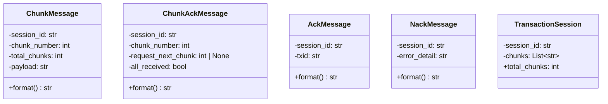
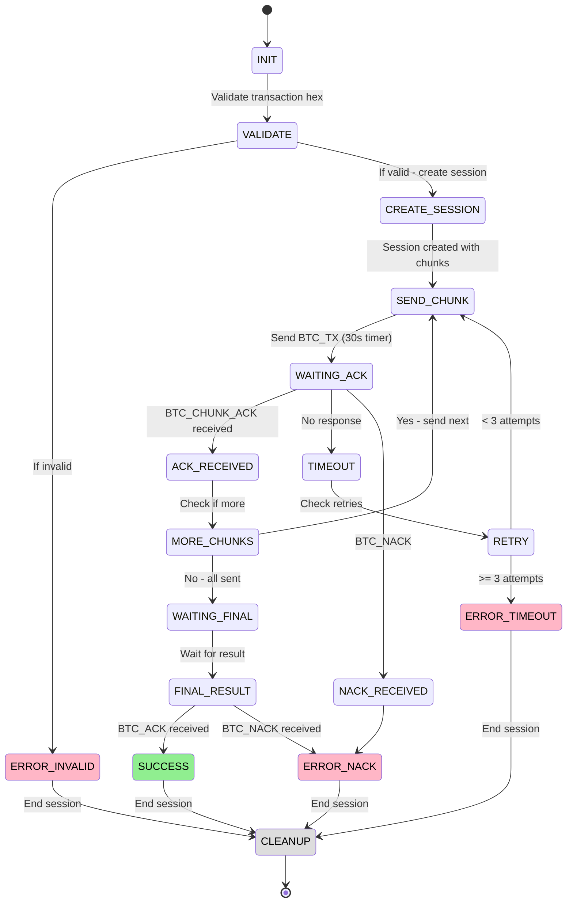
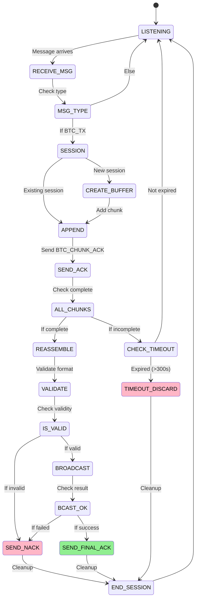
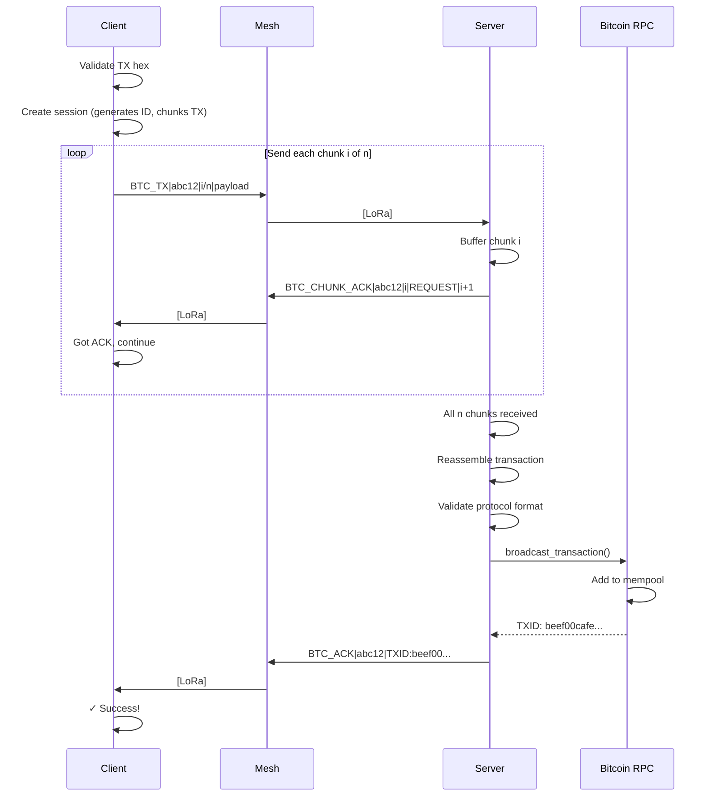
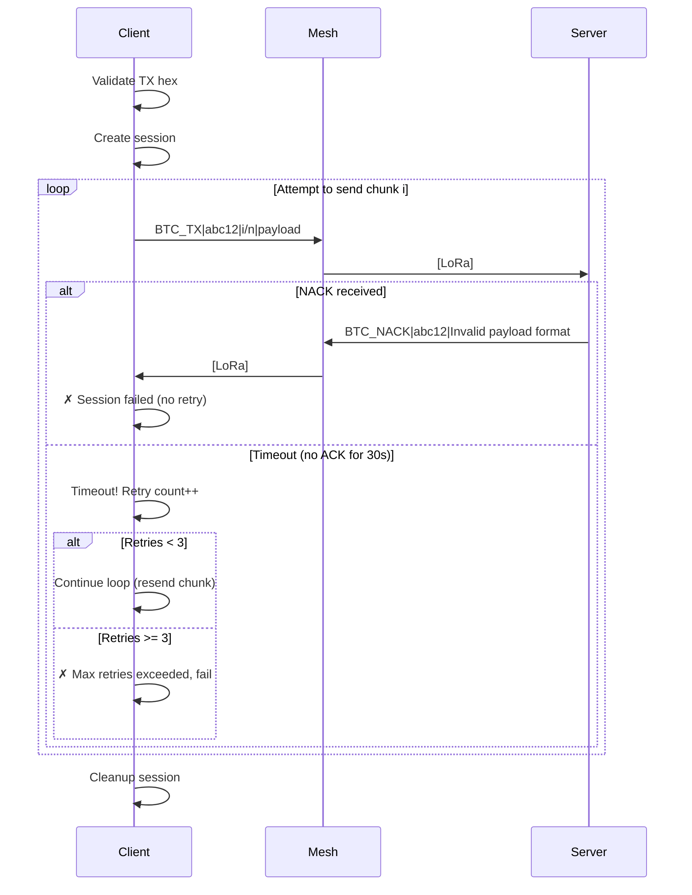
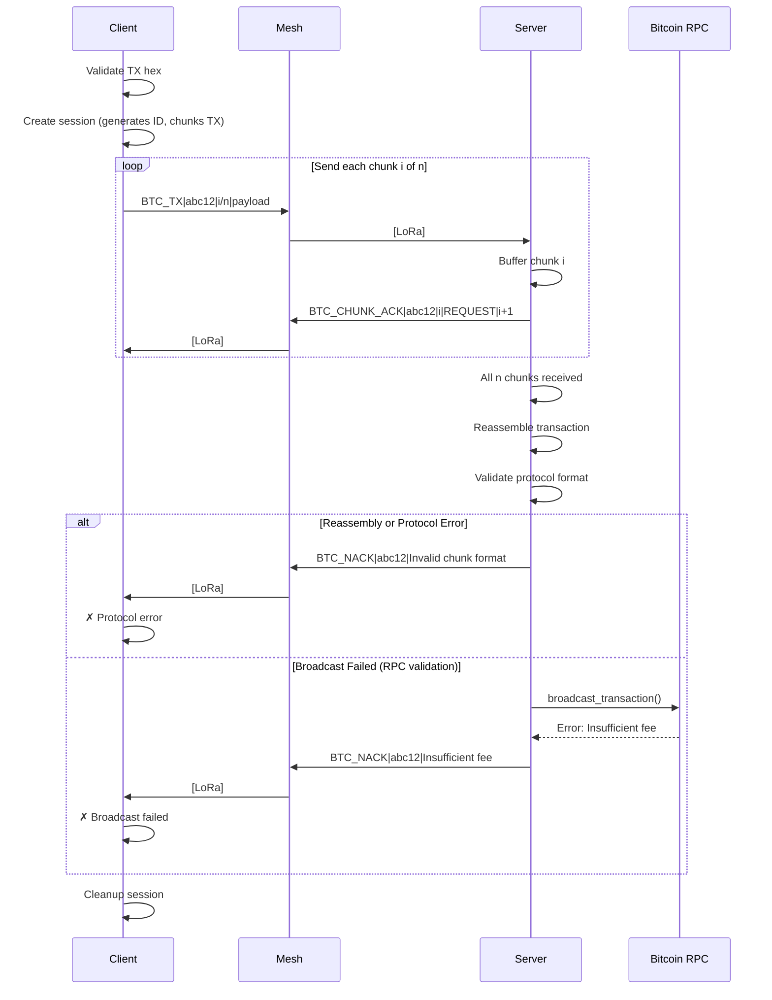
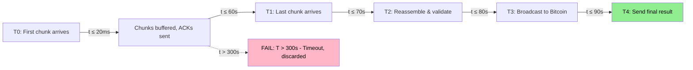

# BTCMesh Protocol Specification

Version 1.0 — February 2026

## Overview

BTCMesh uses a stop-and-wait ARQ protocol to reliably transmit Bitcoin raw transactions over LoRa Meshtastic direct messages. Transactions are chunked into small pieces that fit within LoRa payload limits, sent one at a time with acknowledgment, and reassembled by the server for broadcast to the Bitcoin network.

## Protocol Flow


## Message Types

### 1. BTC_TX (Client → Server)

Transaction chunk containing a fragment of the raw transaction hex.

**Format:** `BTC_TX|<session_id>|<chunk_number>/<total_chunks>|<hex_payload>`

| Field | Type | Description |
|-------|------|-------------|
| `session_id` | string | 5-character hex session identifier |
| `chunk_number` | integer | 1-indexed chunk number |
| `total_chunks` | integer | Total number of chunks in session |
| `hex_payload` | string | Fragment of raw transaction hex |

**Example:** `BTC_TX|a1b2c|1/3|02000000000108bf2c7d...`

### 2. BTC_CHUNK_ACK (Server → Client)

Server acknowledges receipt of a chunk and requests the next, or confirms all chunks received.

**Format (intermediate):** `BTC_CHUNK_ACK|<session_id>|<chunk_number>|REQUEST_CHUNK|<next_chunk>`

**Format (final):** `BTC_CHUNK_ACK|<session_id>|<chunk_number>|ALL_CHUNKS_RECEIVED`

| Field | Type | Description |
|-------|------|-------------|
| `session_id` | string | Session being acknowledged |
| `chunk_number` | integer | Chunk that was received |
| `command` | string | `REQUEST_CHUNK` or `ALL_CHUNKS_RECEIVED` |
| `next_chunk` | integer | Next expected chunk (only with `REQUEST_CHUNK`) |

**Examples:**
- `BTC_CHUNK_ACK|a1b2c|1|REQUEST_CHUNK|2`
- `BTC_CHUNK_ACK|a1b2c|3|ALL_CHUNKS_RECEIVED`

### 3. BTC_ACK (Server → Client)

Confirms transaction was successfully broadcast to the Bitcoin network.

**Format:** `BTC_ACK|<session_id>|TXID:<txid>`

| Field | Type | Description |
|-------|------|-------------|
| `session_id` | string | Session that was broadcast |
| `txid` | string | Bitcoin transaction ID returned by the node |

**Example:** `BTC_ACK|a1b2c|TXID:abc123def456789...`

### 4. BTC_NACK (Server → Client)

Reports an error during reassembly, validation, or broadcast.

**Format:** `BTC_NACK|<session_id>|<error_detail>`

| Field | Type | Description |
|-------|------|-------------|
| `session_id` | string | Session that failed |
| `error_detail` | string | Condensed error message (to make sure it fits within payload and protocol) |

**Example:** `BTC_NACK|a1b2c|Insufficient fee`

Total NACK message length is capped at 200 characters to fit LoRa payload constraints.

## Constants

| Constant | Value | Description |
|----------|-------|-------------|
| Chunk size | 170 hex chars (85 bytes) | Maximum hex payload per chunk |
| Session ID length | 5 hex chars | Random UUID-derived identifier |
| ACK timeout | 30 seconds | Client waits this long for server ACK |
| Max retries | 3 | Maximum retry attempts per chunk |
| Reassembly timeout | 300 seconds (5 min) | Server discards incomplete sessions after this |

## Session ID

- Created by the client and send with each message
- 5-character lowercase hex string
- Generated from `uuid4().hex[:5]`
- Unique per transaction attempt
- Used to correlate chunks, ACKs, and final result across the session

Without session IDs, chunks from different transactions would be impossible to distinguish, especially in a mesh network where messages can arrive out of order or from multiple sources.

## Stop-and-Wait ARQ

The client uses a stop-and-wait Automatic Repeat Request protocol:

1. Send chunk N
2. Wait up to 30 seconds for `BTC_CHUNK_ACK` with matching session and chunk number
3. If ACK received with `REQUEST_CHUNK|N+1`: send chunk N+1
4. If ACK received with `ALL_CHUNKS_RECEIVED`: wait for final `BTC_ACK` or `BTC_NACK`
5. If no ACK received within timeout: retry (up to 3 times)
6. If max retries exceeded: abort session

## Error Condensing

The server condenses RPC error messages for LoRa size constraints. Common mappings:

| Bitcoin Core Error | Condensed |
|-------------------|-----------|
| Transaction outputs already in utxo set | TX already in UTXO set |
| Transaction already in block chain | TX already in chain |
| insufficient fee | Insufficient fee |
| missing inputs | Missing inputs |
| bad-txns-inputs-spent | Inputs spent |
| bad-txns-in-belowout | Input < Output |
| too-long-mempool-chain | Chain too long |
| mempool full | Mempool full |
| replacement transaction | RBF disabled |
| non-mandatory-script-verify-flag | Script verify failed |
| bad-txns-nonstandard-inputs | Non-std inputs |
| bad-txns-oversize | TX too large |
| dust | Dust output |
| fee is too high | Fee too high |
| absurdly-high-fee | Absurd fee |

For reassembly errors (InvalidChunkFormat, MismatchedTotalChunks), the error type and detail are included, truncated to fit the 200-character NACK limit.

## Chunk Sizing

Each Meshtastic text message has a payload limit. The chunk format includes overhead:

```
BTC_TX|<5 chars>|<digits>/<digits>|<payload>
```

With a 5-char session ID and typical chunk numbering (e.g. `12/15`), overhead is ~20 characters. The 170 hex-char payload keeps total message size well within Meshtastic payload limits.

## Multiple Concurrent Sessions

The server supports multiple concurrent sessions from different senders. Sessions are keyed by `(sender_node_id, session_id)`. Each session independently tracks received chunks and timeouts.

---

## UML Diagrams

### 1. Message Class Diagram



**Message Types:**

| Class | Direction | Purpose | Wire Format |
|-------|-----------|---------|-------------|
| `ChunkMessage` | Client→Server | Send transaction chunk | `BTC_TX\|session\|chunk/total\|payload` |
| `ChunkAckMessage` | Server→Client | Acknowledge chunk or signal all received | `BTC_CHUNK_ACK\|session\|chunk\|...` |
| `AckMessage` | Server→Client | Broadcast success with TXID | `BTC_ACK\|session\|TXID:txid` |
| `NackMessage` | Server→Client | Error response | `BTC_NACK\|session\|error` |
| `TransactionSession` | Internal only | Holds session ID + chunked TX list | Not sent (used by sender) |

**First 4 are wire messages, last is internal use only.**

### 2. Client State Machine



### 3. Server State Machine



### 4. Complete Protocol Sequence (Happy Path - Success)



### 4b. Error Scenarios During Chunk Sending



**Key differences:**
- **NACK during chunks**: Session fails immediately (no retry)
- **Timeout**: Retried up to 3 times within the loop
- Both paths lead to session cleanup

### 4c. Error Scenarios After Chunks Complete



**Failure points:**
- **Reassembly validation error**: Malformed protocol format, mismatched chunk counts, etc. (checked by reassembler)
- **Broadcast error**: Invalid TX signature, insufficient fee, missing inputs, non-standard TX, mempool full, etc. (detected by Bitcoin RPC)
- No retry at this level (session ends)

### 5. Session Lifecycle Timeline


